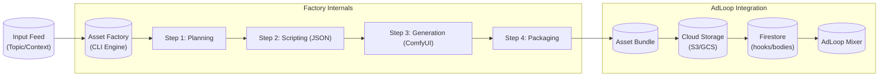

# System V2: Content Asset Factory Architecture

## 1. Executive Summary
The **Content Asset Factory (System V2)** is a headless generation engine designed to supply high-quality, structured media assets to the **AdLoop Platform**. 

Unlike V1, which focused on end-to-end video creation, V2 focuses on generating the **raw ingredients** (Video Layers + Overlay Data) that AdLoop's "Mixer" combines into final ads.

## 2. Core Philosophy
*   **Supplier Model:** The system does not "make ads". It "supplies assets" (Hooks, Bodies, Data) to AdLoop.
*   **Unified Pipeline:** All content (whether a 3s Hook or a 45s Comic Story) is treated as an **Asset**. The logic is defined by the **Template**, and the destination is defined by the **Manifest**.
*   **Code-Driven Control:** We replace "conversational" LLM prompts with strict **JSON Schemas** and **Code Assembly** to ensure constraints (like specific visual blocks) are respected.

## 3. High-Level Architecture



## 4. Component Definitions

### 4.1. The Engine (CLI)
*   **Role:** Job runner and state manager.
*   **Input:** `batch_jobs.json` containing topics (e.g., "David and Goliath", "Jesus Heals").
*   **Capabilities:**
    *   **Queue Management:** Processes jobs in parallel or sequence.
    *   **Resumability:** Saves `state.json` after every step to recover from crashes.

### 4.2. The Template System ("The Blueprints")
A Template is a TypeScript class implementing the `AssetTemplate` interface.

```typescript
interface AssetTemplate {
  id: string; // e.g., "comic-book-v1"
  type: "hook" | "body"; // Default destination
  
  // Steps
  plan(topic: string): Promise<Plan>;
  script(plan: Plan): Promise<Script>;
  generate(script: Script): Promise<Assets>;
}
```

**Key Templates:**
1.  **`ComicBookStory` (Body):** Generates 3-5 images + Narration Data.
2.  **`VisualHook` (Hook):** Generates a single high-impact video/image.

### 4.3. The Service Layer
*   **LLMService:** 
    *   **Model:** `gpt-4o` (Default).
    *   **Feature:** Enforces `zod` schemas for all outputs. No free-text parsing.
*   **ComfyService:**
    *   **Provider:** Replicate or ComfyUI Cloud.
    *   **Logic:** Maps the Template's "Visual Description" to specific ComfyUI node inputs (`positive_prompt`, `lora_strength`, etc.).

### 4.4. The Output Artifact ("The Bundle")
Every job produces a standardized folder structure ready for ingestion.

```text
/output/david-goliath/
├── manifest.json       # The "Passport" for AdLoop
├── assets/
│   ├── page_1.png
│   ├── page_2.png
│   └── hook_intro.mp4 (Optional)
└── data/
    └── overlays.json   # Text strings for AdLoop overlays
```

## 5. AdLoop Integration Strategy
The system bridges the gap via **DataSources**.

1.  **Generation:** System V2 creates the Bundle.
2.  **Ingestion:** A post-processing script (part of V2) performs the "Handshake":
    *   Uploads images/videos to the AdLoop bucket.
    *   Creates documents in the `bodies` collection (for stories) or `hooks` collection (for clips).
    *   Injects the `overlays.json` data into the `extracted_texts` or `metadata` fields of the Firestore document.
3.  **Consumption:** AdLoop's `MyVideoMixAutoTemplate` picks up these new IDs and mixes them.

## 6. Development Phases

### Phase 1: Foundation (The Skeleton)
*   Setup CLI, `Engine`, and `Service` interfaces.
*   Implement `LLMService` with structured output support.

### Phase 2: The Comic Template (Production)
*   Port the "Manual V4" logic into the `ComicBookStory` class.
*   Implement strict JSON generation for Panels.
*   Implement `ComfyService` for `seedream-4`.

### Phase 3: The "Pipeline"
*   Build the `IngestionScript` to push generated assets to a mock Firestore (or real dev env).
*   End-to-End test: Topic -> Images -> Firestore ID.
