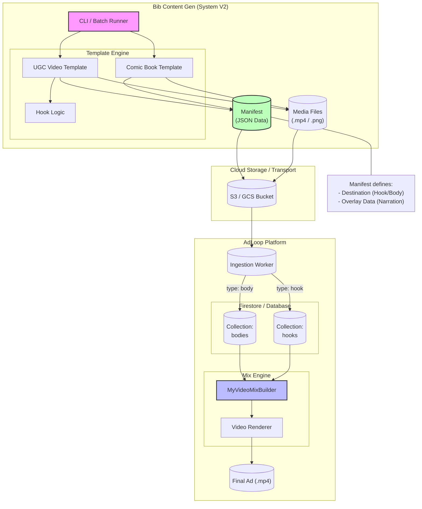

# System Context Diagram: Content Generator <-> AdLoop

```mermaid
graph TD
    %% --- The Generator System (Your Domain) ---
    subgraph "Bib Content Gen (System V2)"
        CLI[CLI / Batch Runner]
        
        subgraph "Template Engine"
            Comic[Comic Book Template]
            UGC[UGC Video Template]
            HookGen[Hook Logic]
        end
        
        CLI --> Comic
        CLI --> UGC
        UGC --> HookGen
        
        %% The Outputs
        Asset_Files[("Media Files\n(.mp4 / .png)")]
        Manifest_JSON[("Manifest\n(JSON Data)")]
        
        Comic --> Asset_Files
        Comic --> Manifest_JSON
        UGC --> Asset_Files
        UGC --> Manifest_JSON
    end

    %% --- The Boundary (Storage) ---
    subgraph "Cloud Storage / Transport"
        S3_Bucket[("S3 / GCS Bucket")]
        Asset_Files --> S3_Bucket
        Manifest_JSON --> S3_Bucket
    end

    %% --- AdLoop Ecosystem (The Client) ---
    subgraph "AdLoop Platform"
        Ingest_Script[("Ingestion Worker")]
        
        subgraph "Firestore / Database"
            DB_Hooks[("Collection:\nhooks")]
            DB_Bodies[("Collection:\nbodies")]
        end
        
        subgraph "Mix Engine"
            Mix_Builder["MyVideoMixBuilder"]
            Renderer["Video Renderer"]
        end
        
        %% Data Flow
        S3_Bucket --> Ingest_Script
        Ingest_Script -->|"type: hook"| DB_Hooks
        Ingest_Script -->|"type: body"| DB_Bodies
        
        DB_Hooks --> Mix_Builder
        DB_Bodies --> Mix_Builder
        
        Mix_Builder --> Renderer
        Renderer --> Final_Ad[("Final Ad (.mp4)")]
    end

    %% --- Explanatory Links ---
    style CLI fill:#f9f,stroke:#333,stroke-width:2px
    style Mix_Builder fill:#bbf,stroke:#333,stroke-width:2px
    style Manifest_JSON fill:#bfb,stroke:#333,stroke-width:2px
    
    %% Details
    classDef note fill:#fff,stroke:#333,stroke-dasharray: 5 5;
    N1["Manifest defines:
    - Destination (Hook/Body)
    - Overlay Data (Narration)"]
    Manifest_JSON --- N1
```
