# AdLoops Technical Implementation - How It Actually Works

## Complete Technical Flow

```mermaid
graph TD
    subgraph "1. Video Components - Just Files in Collections"
        Hooks[(hooks/)]
        Bodies[(bodies/)]
        CTAs[(ctas/)]

        CompStruct["`{
          video: 'file.mp4',
          raw_video: {portrait, square, landscape},
          extracted_texts: ['self datasource'],
          duration: number
        }`"]

        Hooks --> CompStruct
        Bodies --> CompStruct
        CTAs --> CompStruct
    end

    subgraph "2. Optional: AutoTemplate Generation"
        AutoTemp["`AutoTemplateFormat
        {
          dataSource: 'csv',
          prompt: 'generate...',
          interval: 86400
        }`"]

        AutoTemp -->|triggers| AIGen[AI Generates Video]
        AIGen -->|uploads to| Bodies
    end

    subgraph "3. Mix Creation - Combines Components + Defines Overlays"
        Mix["`MyVideoMix
        {
          components: {
            hooks: ['hook-123'],
            bodies: ['body-456', 'body-789'],
            ctas: ['cta-999']
          },
          overlay: [
            {
              overlayId: 'overlay-1',
              generationType: 'manual' | 'auto',
              params: [{key: 'text', value: 'from datasource'}]
            }
          ],
          captions: {template, position},
          crossFadeDuration: 0.4
        }`"]

        CompStruct -->|references| Mix
    end

    subgraph "4. Processing - Generates Final Video"
        Builder[MyVideoMixBuilder]
        Mix --> Builder

        Builder --> Part["`Part with Layers
        videoLayers: [
          {videos: ['hook-123'], overlay: [...]},
          {videos: ['body-456'], overlay: [...]},
          {videos: ['body-789'], overlay: [...]}
        ]`"]

        Part --> Generator[MyVideoMixGenerator]

        Generator --> Steps["`Per Layer:
        1. Re-encode/trim
        2. Add overlays (manual or auto)

        Merge:
        3. Cross-fade layers
        4. Add cross-layer overlays
        5. Add captions (per screen timing)
        6. Mix audio

        Upload to Cloud Storage`"]
    end

    subgraph "5. Final Output"
        Steps --> FinalVideo[(videos/)]

        FinalVideo --> VideoDoc["`{
          video: 'final-ad.mp4',
          raw_video: {portrait, square, landscape},
          part_id: 'mix-part-123',
          mix: true
        }`"]
    end

    classDef collectionNode fill:#e74c3c,stroke:#c0392b,color:#fff,font-weight:bold
    classDef processNode fill:#3498db,stroke:#2980b9,color:#fff
    classDef dataNode fill:#2ecc71,stroke:#27ae60,color:#fff

    class Hooks,Bodies,CTAs,FinalVideo collectionNode
    class Builder,Generator,AIGen processNode
    class CompStruct,Mix,Part,Steps,VideoDoc,AutoTemp dataNode
```

## Key Differences from Conceptual Model

| Conceptual | Technical Reality |
|---|---|
| Components are "Baked" or "Asset With Overlay" | All components are just video files |
| Overlays defined at component level | Overlays defined at mix level |
| "GENERATED vs ASSET" component types | AutoTemplate workflow → generates → becomes regular component |
| "SELF OVERLAY" separate path | Just don't add overlays if video is complete |
| "PER SCREEN" required for all | Only for captions (SRT files) |
| PRE-MADE vs GENERATED ✅ | `generationType: "manual" \| "auto"` ✅ |
| Overall vs Self datasource ✅ | `dataSource` vs `extracted_texts` ✅ |

## Data Sources

**Overall Datasource:** `AutoTemplateFormat.dataSource` (CSV, BigQuery, Firestore)
- Used in: `overlay.params` values
- Example: Story title, verse reference, character names

**Self Datasource:** `extracted_texts` field on component
- Used in: Captions, transcriptions
- Example: Speech-to-text from video audio
