# AdLoops Vertical Stack Model

## Overview

Each component (HOOK, BODY, CTA) in an ad is processed as a **vertical stack of layers** that get composited together.

---

## The Vertical Stack - Per Component

```mermaid
graph TD
    subgraph "HOOK Component Stack"
        H1[🎬 Base Video File<br/>hook-123.mp4]
        H2[📝 Overlay Layer 1<br/>Title text overlay]
        H3[📝 Overlay Layer 2<br/>Graphics/stickers]
        H4[🔊 Audio Layer<br/>Sound effects optional]

        H1 --> H2
        H2 --> H3
        H3 --> H4
    end

    subgraph "BODY Component Stack"
        B1[🎬 Base Video File<br/>body-456.mp4<br/>Your comic book slideshow]
        B2[📝 Overlay Layer 1<br/>Character dialogue]
        B3[📝 Overlay Layer 2<br/>Bible verse reference]
        B4[📝 Overlay Layer 3<br/>Scene captions]
        B5[🔊 Audio Layer<br/>Voiceover + Music]

        B1 --> B2
        B2 --> B3
        B3 --> B4
        B4 --> B5
    end

    subgraph "CTA Component Stack"
        C1[🎬 Base Video File<br/>cta-999.mp4]
        C2[📝 Overlay Layer<br/>Download Bible Chat]
        C3[🔊 Audio Layer<br/>Call-to-action sound]

        C1 --> C2
        C2 --> C3
    end

    classDef videoNode fill:#3498db,stroke:#2980b9,color:#fff
    classDef overlayNode fill:#9b59b6,stroke:#8e44ad,color:#fff
    classDef audioNode fill:#e74c3c,stroke:#c0392b,color:#fff

    class H1,B1,C1 videoNode
    class H2,H3,B2,B3,B4,C2 overlayNode
    class H4,B5,C3 audioNode
```



---

## Complete Ad Structure - Timeline + Vertical Stacks

```mermaid
graph LR
    subgraph "Timeline (Horizontal)"
        direction LR
        Hook[🎯 HOOK<br/>3 seconds]
        Body[📖 BODY<br/>15 seconds]
        CTA[🎬 CTA<br/>2 seconds]

        Hook -->|cross-fade| Body
        Body -->|cross-fade| CTA
    end

    subgraph "Each Component Has Vertical Stack"
        Stack["🎬 Base Video<br/>⬇️<br/>📝 Overlay 1<br/>⬇️<br/>📝 Overlay 2<br/>⬇️<br/>📝 Overlay n...<br/>⬇️<br/>🔊 Audio"]
    end

    Hook -.->|has| Stack
    Body -.->|has| Stack
    CTA -.->|has| Stack

    classDef timelineNode fill:#2ecc71,stroke:#27ae60,color:#fff,font-weight:bold
    classDef stackNode fill:#f39c12,stroke:#d68910,color:#fff

    class Hook,Body,CTA timelineNode
    class Stack stackNode
```



---

## Vertical Stack Processing Order

### For Each Component (Hook/Body/CTA):

```
1. 🎬 BASE VIDEO
   └─> Load video file from collection
       Example: bodies/comic-book-slideshow.mp4

2. 📝 OVERLAY LAYER 1 (Per-Layer)
   └─> Apply first overlay
       Source: PRE-MADE or GENERATED
       Data: From Overall Datasource (CSV) or Self Datasource (extracted_texts)
       Result: Video + Overlay 1

3. 📝 OVERLAY LAYER 2 (Per-Layer)
   └─> Apply on top of previous result
       Stack overlays sequentially
       Result: Video + Overlay 1 + Overlay 2

4. 📝 OVERLAY LAYER n... (Per-Layer)
   └─> Continue stacking overlays
       Each overlay is composited on previous result

5. 🔊 AUDIO LAYER (Optional)
   └─> Mix audio with video
       Voiceover: 100% volume (primary)
       Music: 20% volume (background)
       Result: Final component video with audio
```

### After All Components Processed:

```
6. 🎞️ CROSS-FADE MERGE
   └─> Merge Hook → Body → CTA with transitions
       Duration: 0.4s cross-fade between each

7. 📝 CROSS-LAYER OVERLAYS (Optional)
   └─> Apply overlays that span multiple components
       Example: Logo watermark visible throughout entire ad
       Uses: offset + layersLength

8. 💬 CAPTIONS (Optional)
   └─> Add timed captions from SRT file
       This is the "PER SCREEN" timing
       Different text per timestamp

9. 🔊 FINAL AUDIO MIX
   └─> Mix all audio layers together
       Adjust volumes, add background music

10. ✅ UPLOAD
    └─> Upload final MP4 to Cloud Storage
        Create video document in videos/ collection
```

---

## Example: David & Goliath Body Stack

```
🎬 BASE VIDEO: comic-book-slideshow.mp4
   ├─ Frame 1: David in valley (3s)
   ├─ Frame 2: Goliath appears (3s)
   ├─ Frame 3: David picks stones (3s)
   ├─ Frame 4: David defeats Goliath (3s)
   └─ Total: 12 seconds

📝 OVERLAY 1: Title Card (from CSV)
   ├─ Text: "David & Goliath"
   ├─ Position: Top center
   ├─ Duration: Entire video (0-12s)
   └─ Source: Overall Datasource (row.story_title)

📝 OVERLAY 2: Verse Reference (from CSV)
   ├─ Text: "1 Samuel 17:45"
   ├─ Position: Bottom left
   ├─ Duration: Entire video (0-12s)
   └─ Source: Overall Datasource (row.verse)

📝 OVERLAY 3: Dialogue Captions (from Self Datasource)
   ├─ 0-3s: "David walked to the valley"
   ├─ 3-6s: "Goliath challenged Israel"
   ├─ 6-9s: "David picked up five stones"
   ├─ 9-12s: "With faith, David defeated Goliath"
   └─ Source: Self Datasource (extracted_texts)

🔊 AUDIO: Voiceover + Music
   ├─ Voiceover: TTS narration (100% volume)
   │   "The story of David and Goliath shows..."
   ├─ Music: Background instrumental (20% volume)
   └─ Mixed together, aligned with video
```

**Result:** One complete Body component ready to merge with Hook and CTA

---

## Code Mapping

### Vertical Stack in Code

```typescript
// 1. BASE VIDEO - Component reference
MyVideoMixPartLayer {
  videos: ["comic-book-slideshow.mp4"]  // 🎬 Base
}

// 2-4. OVERLAY LAYERS - Per-layer overlays
MyVideoMixPartLayer {
  videos: ["comic-book-slideshow.mp4"],
  overlay: [                             // 📝 Stack of overlays
    {
      overlayId: "title-overlay",
      generationType: "auto",
      params: [{key: "title", value: "David & Goliath"}]
    },
    {
      overlayId: "verse-overlay",
      generationType: "auto",
      params: [{key: "verse", value: "1 Samuel 17:45"}]
    }
  ]
}

// 5. AUDIO LAYER - Audio mix
MyVideoMixPartDoc {
  audioLayers: [                         // 🔊 Audio stack
    {
      fileName: "voiceover.mp3",
      volume: 100                        // Primary audio
    },
    {
      fileName: "background-music.mp3",
      volume: 20                         // Background
    }
  ]
}

// 7. CROSS-LAYER OVERLAYS - After merge
MyVideoMixPartDoc {
  overlay: [                             // 📝 Spans components
    {
      overlayId: "logo-watermark",
      offset: 0,                         // Starts at beginning
      layersLength: 3                    // Spans Hook+Body+CTA
    }
  ]
}

// 8. CAPTIONS - Timed text
MyVideoMixPartDoc {
  captions: {
    template: "style1",
    position: "bottom"
  },
  srtFileName: "captions.srt"            // 💬 Per-screen timing
}
```

### Processing in MyVideoMixGenerator

```typescript
class MyVideoMixGenerator {
  async buildVideoLayer(layer: MyVideoMixPartLayer) {
    // 1. Load base video
    let video = await loadVideo(layer.videos[0]);  // 🎬

    // 2-4. Apply per-layer overlays sequentially
    for (const overlay of layer.overlay) {         // 📝
      video = await applyOverlay(video, overlay);
    }

    return video;  // Video with all overlays stacked
  }

  async buildVideoLayers() {
    // Process each component's stack
    let hook = await this.buildVideoLayer(hookLayer);
    let body = await this.buildVideoLayer(bodyLayer);
    let cta = await this.buildVideoLayer(ctaLayer);

    // 6. Merge with cross-fade
    let merged = await crossFade(hook, body, cta);

    // 7. Apply cross-layer overlays
    merged = await applyOverlays(merged, crossLayerOverlays);

    // 8. Add captions
    merged = await addCaptions(merged, srtFile);

    // 9. Mix audio
    merged = await mixAudio(merged, audioLayers);  // 🔊

    return merged;
  }
}
```

---

## Key Insights

### 1. **Each Component is Independent**
- Hook has its own stack
- Body has its own stack
- CTA has its own stack
- They're processed separately, then merged

### 2. **Stacking Order Matters**
- Base video first
- Overlays applied in sequence (each on top of previous)
- Later overlays cover earlier ones

### 3. **Two Types of Overlays**
- **Per-layer**: Applied to individual components before merge
- **Cross-layer**: Applied to final merged video after cross-fade

### 4. **Audio is Final Layer**
- Mixed after all visual layers complete
- Multiple audio tracks can be stacked (voiceover + music)

### 5. **Your Comic Book = One Layer in Body Stack**
```
Your comic slideshow MP4
    ↓
+ Overlay layers (text, graphics)
    ↓
+ Audio layers (voiceover, music)
    ↓
= Complete Body component
    ↓
Merged with Hook and CTA
    ↓
= Final ad
```

---

## Visual Summary

```
FINAL AD = Timeline of Stacks

┌─────────────────────────────────────────────────┐
│  HOOK Stack  │  BODY Stack  │  CTA Stack       │ ← Timeline (Horizontal)
│              │              │                   │
│  🎬 Video    │  🎬 Video    │  🎬 Video         │
│  📝 Overlay  │  📝 Overlay  │  📝 Overlay       │
│  📝 Overlay  │  📝 Overlay  │  🔊 Audio         │
│  🔊 Audio    │  📝 Overlay  │                   │
│              │  🔊 Audio    │                   │ ← Vertical Stacks
└─────────────────────────────────────────────────┘
         ↓ Cross-fade          ↓ Cross-fade
┌─────────────────────────────────────────────────┐
│          Merged Final Video                     │
│  + Cross-layer overlays (logo, watermark)      │
│  + Captions (timed per-screen)                 │
│  + Final audio mix                              │
└─────────────────────────────────────────────────┘
```

---

*This vertical stack model makes it easier to understand how components are built before being merged into the final ad timeline.*
