# Video Generation: Problem-Solving Framework

**Date**: October 23, 2025
**Status**: Active - Updated with POC decision and template design
**Purpose**: Comprehensive decision tracking and problem-solving documentation
**Replaces**: `solution-decision-tree.md`, `workflow-problems-and-solutions.md`

---

## Decision Overview (Visual)

**Testing Status**: Decisions validated through testing and template design (Oct 20-23, 2025)
- Frame chaining: ✅ Validated with minimal prompts (Oct 22)
- Veo audio: ✅ Acceptable for POC with `negative_prompt` (Oct 23)
- External TTS: 📋 Deferred to production (voice changes acceptable for POC)
- Simplified prompts: ✅ Strongly validated (prevents mid-scene changes)
- Template design: ✅ Complete framework documented (Oct 23)

```mermaid
flowchart TD
    Start["Problem: Dialogue Duration + Character Consistency"]

    Start --> Q1{"Generate dialogue as?"}
    Q1 -->|Full script first| FullDialogue["Generate fullDialogue<br/>✅ CHOSEN"]
    Q1 -->|Separate chunks| Chunks["Generate 3 chunks directly<br/>❌ NOT CHOSEN"]

    FullDialogue --> Q2{"Scene count?"}
    Q2 -->|Dynamic based on duration| Dynamic["Calculate from targetDuration<br/>⏸️ NOT CHOSEN - Future"]
    Q2 -->|Fixed for POC| Fixed["Fixed: 3 scenes × 8 sec<br/>✅ CHOSEN - Derived from constraint"]

    Fixed --> Q3{"How to break dialogue?"}
    Q3 -->|LLM breaks naturally| LLM["CALL 1.5: LLM breaks at pauses<br/>⏸️ NOT NEEDED"]
    Q3 -->|Rule-based split| Rules["Split by punctuation/words<br/>❌ NOT CHOSEN"]
    Q3 -->|Don't break - use full dialogue| NoBreak["Use external TTS with full dialogue<br/>✅ CHOSEN"]

    LLM --> Q4{"Voice generation?"}
    Rules --> Q4
    NoBreak --> Q4
    Q4 -->|Veo generates audio| VeoAudio["Use Veo generate_audio<br/>✅ POC: OK with negative_prompt<br/>📋 Production: Use external TTS"]
    Q4 -->|External TTS| External["External TTS<br/>📋 Deferred to production"]

    VeoAudio --> Q5{"Character consistency?"}
    External --> Q5
    Q5 -->|Frame chaining| Chain["Use image + last_frame<br/>✅ CHOSEN - validated Oct 20/22"]
    Q5 -->|Reference images| Ref["Use reference_images<br/>🚫 BLOCKED - needs 16:9"]

    Chain --> Q6{"Neutral pose approach?"}
    Q6 -->|First frame from Scene 1| FirstFrame["Extract first frame<br/>✅ CHOSEN"]
    Q6 -->|Text-to-image generation| T2I["Generate neutral pose first<br/>⏸️ ALTERNATIVE"]
    Q6 -->|Middle frame extraction| MiddleFrame["Extract middle frame<br/>⏸️ ALTERNATIVE"]

    FirstFrame --> Q7{"Prompt strategy?"}
    T2I --> Q7
    Q7 -->|Full prompts all scenes| FullPrompts["Full descriptive all scenes<br/>❌ NOT CHOSEN - causes mid-scene changes"]
    Q7 -->|Simplified scenes 2-3| SimplifiedPrompts["Scene 1: full, Scenes 2-3: minimal<br/>✅ CHOSEN - strongly validated Oct 22"]

    SimplifiedPrompts --> Q9{"Dialogue in prompts?"}
    Q9 -->|Include dialogue| WithDialogue["Include dialogue in prompts<br/>✅ CHOSEN - tested, works"]
    Q9 -->|No dialogue| NoDialogue["Generic 'speaking' prompts<br/>❌ NOT CHOSEN"]

    WithDialogue --> End["POC Solution Design<br/>(TTS+Lipsync deferred to production)"]

    style Start fill:#ff69b4,stroke:#fff,stroke-width:3px,color:#000
    style FullDialogue fill:#9f9,stroke:#333,stroke-width:2px
    style Fixed fill:#9f9,stroke:#333,stroke-width:2px
    style NoBreak fill:#9f9,stroke:#333,stroke-width:2px
    style VeoAudio fill:#9f9,stroke:#333,stroke-width:2px
    style External fill:#ff9,stroke:#333,stroke-width:2px
    style Chain fill:#9f9,stroke:#333,stroke-width:2px
    style FirstFrame fill:#9f9,stroke:#333,stroke-width:2px
    style SimplifiedPrompts fill:#9f9,stroke:#333,stroke-width:2px
    style WithDialogue fill:#9f9,stroke:#333,stroke-width:2px
    style Chunks fill:#f99,stroke:#333,stroke-width:2px
    style Rules fill:#f99,stroke:#333,stroke-width:2px
    style Ref fill:#f99,stroke:#333,stroke-width:2px
    style FullPrompts fill:#f99,stroke:#333,stroke-width:2px
    style NoDialogue fill:#f99,stroke:#333,stroke-width:2px
    style End fill:#9ff,stroke:#333,stroke-width:3px
```



---

## POC vs Production Approach

**POC Decision (October 23, 2025)**: Use Veo audio with `negative_prompt` for proof of concept

**Reasoning**:
- Testing showed 99% quality with dialogue in prompts + `negative_prompt: "background music"`
- Voice changes between scenes present but acceptable for POC
- Significantly simpler implementation (no TTS or lipsync integration)
- Faster iteration and validation

**Production Recommendation**: External TTS + Lipsync
- Guarantees consistent voice across all scenes
- Better audio quality control
- Eliminates voice change issue
- Adds complexity but improves production quality

**Current Status**: POC using Veo audio; TTS+lipsync deferred to backlog

---

## 1. Hard Constraints (Unchangeable)

### API Constraints
- **Veo 3.1 max duration**: 4, 6, or 8 seconds per clip
- **Veo 3.1 aspect ratios**: 16:9 or 9:16
- **Veo 3.1 reference_images**: Only works with 16:9 (blocked for us)
- **Veo 3.1 available params**: `image`, `last_frame`, `generate_audio`, `duration`, `aspect_ratio`, `resolution`, `seed`, `negative_prompt`

### Product Requirements
- **Target duration**: 15-20 seconds total (d2c template)
- **Aspect ratio**: 9:16 (vertical video for mobile)
- **Content**: Person speaking to camera addressing user problem
- **Quality**: Professional, consistent character/setting

### Technical Requirements
- **Budget**: Minimize costs
- **Stack**: TypeScript, Node.js, Replicate API
- **Output**: Video file + manifest JSON

### Derived Constraints
- **Number of clips**: 3 (24 seconds ÷ 8 seconds = 3 clips)
- **Cost per clip**: $1.60 without audio, $3.20 with audio
- **Generation time**: ~70 seconds per clip

---

## 2. Problem 1: Dialogue Duration Mismatch

### Problem Statement
Natural conversational dialogue requires 15-30 seconds, but Veo 3.1 max duration is 8 seconds per clip.

**Example:**
```
Generated dialogue: "You know, sometimes it feels like everything is piling up—
financial struggles, work stress, and the responsibilities of marriage and kids.
It can be overwhelming, can't it?"

Speech duration: ~15 seconds
Veo limit: 8 seconds
Result: ❌ Cut off mid-sentence
```

### Hypotheses Tested

#### Hypothesis 1.1: Veo audio is consistent across clips
**Test method**:
- Initial test (Oct 20): Generate 2 clips with Veo audio, compare levels
- Extended test (Oct 22): Generate multiple scenes with negative_prompt and same seed

**Results**:
❌ **FAILED** - Audio levels and quality vary between clips
- Volume levels differ (Oct 20 finding)
- Voice quality varies (Oct 20 finding)
- Music intrusion in some scenes (Oct 22 finding - Test 8)
- Speaker characteristics change even with same seed (Oct 22 finding - Test 10)
  - Pitch/tone differences
  - Accent variations
  - Speaking style inconsistencies

**Mitigations tested**:
- ✅ `negative_prompt: "background music"` eliminates music (Test 9)
- ⚠️ Same seed provides minimal improvement (Test 10)
- ❌ Voice characteristics still change despite optimizations

**Evidence**: Multiple rounds of manual testing (Oct 20, Oct 22); comprehensive evaluation in Test 12

**Conclusion**: Veo audio fundamentally inconsistent across separate API calls

**Decision impact**: Must use external TTS

#### Hypothesis 1.2: External TTS provides consistent audio
**Test method**: Not yet tested (pending lipsync validation)
**Expected result**: Consistent voice/levels across full 24s
**Decision impact**: Enables full dialogue without breaking

### Decisions Made

#### Decision 1.1: Use external TTS (generate_audio: false)
**Reasoning**:
- Veo audio inconsistent (tested, failed)
- External TTS provides consistent voice/levels
- Can use full dialogue without breaking into chunks
- Cost savings: $1.60/clip vs $3.20/clip

**Trade-offs**:
- More complex workflow (TTS + lipsync steps)
- Additional API integration
- Need lipsync model

**Status**: ✅ Decided

#### Decision 1.2: Don't break dialogue into chunks
**Reasoning**:
- With external TTS, can generate full 20-24s audio
- No need to break dialogue to fit 8s clips
- Simpler script generation (no CALL 1.5 needed)

**Status**: ✅ Decided

#### Decision 1.3: Generate full dialogue (voiceScript field)
**Reasoning**:
- Ensures narrative coherence
- Single TTS generation for entire video
- Used by lipsync model for final sync

**Status**: ✅ Decided

### Open Questions

#### OQ 1.1: Which TTS provider? (Priority: MEDIUM)
**Options**:
- ElevenLabs (high quality, $$$)
- OpenAI TTS (good quality, $$)
- Google Cloud TTS (cheaper, less natural)

**Criteria**:
- Voice quality and naturalness
- Cost per character/second
- API reliability
- Processing speed

**Next step**: Test ElevenLabs and OpenAI TTS with sample voiceScript

#### OQ 1.2: Audio sync timing approach? (Priority: LOW)
**Options**:
- Manual timing in video editor
- Programmatic audio stretching
- Let platform handle it

**Blocked by**: Lipsync model selection

---

## 3. Problem 2: Character & Scene Consistency

### Problem Statement
Each Veo clip is generated independently with no reference to previous clips, resulting in different characters/settings across scenes.

**Example**:
- Scene 1: Person A in Living Room 1
- Scene 2: Person B in Living Room 2
- Scene 3: Person C in Different Room

### Hypotheses Tested

#### Hypothesis 2.1: Frame chaining maintains character consistency
**Test method**: Manual testing on Replicate UI
- Generate Scene 1
- Extract last frame (manual screenshot initially)
- Generate Scene 2 with Scene 1's last frame as `image` parameter
- Compare character/setting

**Results**:
- ⚠️ **Initial test (manual screenshot)**: Character maintained, slight lighting variation
- ✅ **Improved test (programmatic extraction)**: Perfect visual continuity, no lighting differences

**Evidence**:
- Precise frame extraction critical (ffmpeg: `select='eq(n,191)'` for 24fps 8s video)
- Manual screenshots introduce resolution/timing issues

**Decision impact**: Frame chaining validated, can proceed with implementation

#### Hypothesis 2.2: Simplified prompts improve transitions
**Test method**:
- Initial test (Oct 20): Compare full vs minimal prompts
- Validation test (Oct 22): Test prompt override behavior (Test 6, Test 7)

**Results**:
- ✅ Minimal prompt: 10% better transition quality (Oct 20)
- ✅ Minimal prompt: Perfect visual continuity (Oct 22 - Test 7)
- ❌ Full prompt: Causes mid-scene setting changes (Oct 22 - Test 6)

**Evidence**:
- Test 6: Full prompt with kitchen description caused unwanted scene transition
- Test 7: Minimal prompt maintained all visual elements from `image` parameter

**Reasoning**:
- `image` parameter provides visual context
- Verbose prompts create conflicts, overriding image mid-scene
- Minimal prompts let image dominate, only adding dialogue/expression

**Decision impact**: **Strongly validates** Decision 2.3 - Use simplified prompts for scenes 2-3

#### Hypothesis 2.3: Pose continuity problem
**Discovery**: Scene 1 can end in any random pose (e.g., cup at mouth, hand mid-gesture)
**Impact**: Scene 2 starting from that pose + dialogue prompt = awkward transitions
**Example**: Person with cup at mouth trying to speak
**Solution needed**: Neutral pose management

### Decisions Made

#### Decision 2.1: Use frame chaining (image + last_frame parameters)
**Reasoning**:
- Tested and validated manually
- Precise extraction eliminates lighting variations
- Works with 9:16 aspect ratio

**Implementation**:
- Extract last frame programmatically: `ffmpeg -i scene.mp4 -vf "select='eq(n,191)'" -frames:v 1 last_frame.jpg`
- Use as `image` parameter for next scene
- Set `last_frame` to neutral pose

**Status**: ✅ Validated and decided

#### Decision 2.2: Extract first frame from Scene 1 as neutral pose
**Reasoning**:
- First frame is Veo's initial state (likely most neutral)
- Before action/dialogue starts
- Easy to extract programmatically
- Character-specific (same person/setting guaranteed)

**Implementation**:
- Generate Scene 1 without `last_frame` constraint
- Extract first frame: `ffmpeg -i scene1.mp4 -vf "select='eq(n,0)'" -frames:v 1 neutral_pose.jpg`
- Use as `last_frame` for scenes 2 & 3

**Trade-off**: Scene 1 → Scene 2 transition might have one awkward moment (acceptable)

**Status**: ✅ Decided

#### Decision 2.3: Simplify prompts for scenes 2-3
**Reasoning**:
- Testing showed 10% better transitions
- `image` parameter provides visual context
- Verbose prompts conflict with frame reference

**Implementation**:
- Scene 1: Full descriptive prompt
- Scene 2-3: Minimal continuation prompts ("Person continues speaking: 'dialogue'")

**Status**: ✅ Decided

### Open Questions

#### OQ 2.1: Neutral pose alternatives? (Priority: LOW)
**Current approach**: First frame from Scene 1

**Alternatives**:
- Middle frame extraction (frame 96 of 192)
- Text-to-image generation before video pipeline
- Accept random poses, regenerate if awkward

**Next step**: Test current approach first; revisit if quality issues

#### OQ 2.2: Scene 1 regeneration? (Priority: LOW)
**Question**: Should Scene 1 be regenerated with `last_frame: neutral_pose.jpg` after extracting neutral pose?

**Trade-off**:
- ✅ All scenes start/end in neutral pose
- ❌ Double generation cost for Scene 1
- ❌ Adds complexity

**Next step**: Test without regeneration first

---

## 4. Problem 3: Lipsync Requirements

### Problem Statement
With external TTS, video and audio are generated separately and must be synchronized.

### Hypotheses Tested

#### Hypothesis 3.1: Veo generates mouth movement with dialogue prompts (even without audio)
**Test method**: Generate video with dialogue in prompt and `generate_audio: false`
**Result**: ✅ **VALIDATED** - Veo animates mouth movement from dialogue prompt even when audio generation is disabled
**Evidence**: Manual testing confirmed natural mouth movement and speaking expressions generated
**Impact**: Can use dialogue prompts to get natural animation without Veo audio

**Note**: Modern lipsync models (Wav2Lip, SadTalker, etc.) do not necessarily require existing mouth movement - they can work with static mouths. However, starting with natural mouth movement may produce better results.

### Open Questions

#### OQ 3.1: Which lipsync model? (Priority: HIGH)
**Options**:
- Wav2Lip (common, well-documented)
- SadTalker (newer, potentially higher quality)
- Replicate-hosted options
- Custom implementation

**Criteria**:
- Quality of lip sync
- Processing time
- Cost
- API availability

**Blocked by**: Needs testing with actual generated videos

### Decisions Made

#### Decision 3.1: Include dialogue in prompts
**Reasoning**:
- Testing confirmed Veo generates natural mouth movement from dialogue prompts even with `generate_audio: false`
- Provides better starting point for lipsync (natural expressions and mouth shapes)
- Modern lipsync models can work with either static or moving mouths, but moving mouths may yield better results

**Implementation**:
- Keep dialogue in all scene prompts
- Set `generate_audio: false` to avoid Veo audio
- Use lipsync model to sync TTS audio to video with existing mouth movement

**Status**: ✅ Decided based on testing

---

## 5. Current Solution Design

### Overview

Based on all decisions and testing, the validated solution uses:
- **External TTS** (not Veo audio) for consistent voice across entire video
- **Frame chaining** with `image`/`last_frame` parameters for character consistency
- **First frame extraction** from Scene 1 as neutral pose
- **Simplified prompts** for scenes 2-3 (dialogue-only)
- **Lipsync model** to sync TTS audio to combined video
- **No dialogue breaking** - full 20-24s dialogue generated once

This produces a 24-second video with consistent character, setting, and audio.

---

### High-Level Pipeline

```
userProblem + template (d2c)
    ↓
CALL 1: Generate Script Content
    → videoScript (concept)
    → voiceScript (full dialogue)
    → scenes[].description (visual descriptions)
    ↓
CALL 2: Generate Veo Prompts
    → scenes[].prompt (Veo-optimized)
    ↓
TTS Generation (parallel with video)
    → voiceAudio.mp3 (24s audio from voiceScript)
    ↓
AI Video Gen Subworkflow (Visual Only)
    → Scene 1, 2, 3 generation with frame chaining
    → Frame extraction (neutral pose + last frames)
    → Combine clips → combined_silent.mp4
    ↓
Lipsync Model
    → combined_silent.mp4 + voiceAudio.mp3
    → videoFinal.mp4
    ↓
Save manifest.json + videoFinal.mp4
```

---

### Detailed Flow

#### Step 1: Script Generation (CALL 1)

**Input:**
```json
{
  "userProblem": "Financial struggles, marriage, work, children",
  "problemCategory": "Anxiety or fear",
  "contentTemplate": "direct-to-camera"
}
```

**LLM Call (OpenAI):**
- System prompt: d2c template systemPromptCall1 (with Veo 3.1 guidelines)
- Generates structured output via Zod schema

**Output:**
```json
{
  "videoScript": "This video offers comfort to someone overwhelmed by financial struggles, work stress, and family responsibilities. It acknowledges their anxiety, provides reassurance, and encourages small steps.",

  "voiceScript": "You know, sometimes it feels like everything is piling up—financial struggles, work stress, and the responsibilities of marriage and kids. It can be overwhelming, can't it? I want you to know that it's okay to feel scared or anxious about these things. Many people are in the same boat as you, and you're not alone in this struggle. Remember, it's okay to take small steps towards managing those worries. Talk to your partner, seek support, or even create a budget together—these things can really help lighten the load.",

  "scenes": [
    {
      "sceneNumber": 1,
      "description": "Person in their 30s sitting on comfortable couch in cozy, softly lit living room. Holding warm mug of tea. Leaning forward slightly with sincere and understanding expression, looking directly at camera. Open body language. Speaking with anxious yet warm demeanor. Medium close-up framing. Natural window light from side."
    },
    {
      "sceneNumber": 2,
      "description": "Same setting with slightly brighter lighting symbolizing mood shift. Person smiles gently with reassuring expression. Open body language, hands gesturing softly to convey warmth and relatability. Close-up framing focusing on face to emphasize sincerity."
    },
    {
      "sceneNumber": 3,
      "description": "Person seated with more confident posture. Even brighter lighting suggesting hope. Smiling warmly, exuding calmness and encouragement. Medium shot framing invites viewer to feel empowered and hopeful."
    }
  ]
}
```

**Cost**: ~$0.002
**Time**: ~8 seconds

---

#### Step 2: Prompt Generation (CALL 2)

**Input:** scenes[].description from Step 1

**LLM Call (OpenAI):**
- System prompt: d2c template systemPromptCall2
- Scene-specific rules:
  - Scene 1: Full descriptive prompt
  - Scenes 2-3: Simplified continuation prompts

**Output:**
```json
{
  "scenes": [
    {
      "sceneNumber": 1,
      "description": "...",
      "prompt": "Medium close-up of relatable person in their 30s sitting on comfortable couch in cozy, softly lit living room, holding warm mug of tea. They lean forward slightly, actively speaking with sincere and understanding expression. Anxious yet warm demeanor, open body language. Natural window lighting from side. 9:16 vertical framing."
    },
    {
      "sceneNumber": 2,
      "description": "...",
      "prompt": "Person continues speaking with gentle smile and warm, reassuring expression. Open body language with soft hand gestures conveys warmth and relatability."
    },
    {
      "sceneNumber": 3,
      "description": "...",
      "prompt": "Person continues with confident posture, smiling warmly with calm expression. Encouraging and hopeful tone."
    }
  ]
}
```

**Cost**: ~$0.002
**Time**: ~5 seconds

---

#### Step 3: TTS Generation

**Input:** voiceScript from Step 1

**TTS API Call (ElevenLabs or OpenAI TTS):**
```
voiceScript → TTS API → voiceAudio.mp3
```

**Output:**
- File: `voiceAudio.mp3`
- Duration: ~23.5 seconds (actual speech time)

**Cost**: ~$0.15-0.30 (depending on provider)
**Time**: ~3-5 seconds

---

#### Step 4: AI Video Gen Subworkflow

**Input:** scenes[].prompt from Step 2

##### Scene 1 Generation

**Veo 3.1 API Call (Replicate):**
```json
{
  "model": "google-deepmind/veo-3.1",
  "input": {
    "prompt": scenes[0].prompt,
    "duration": 8,
    "aspect_ratio": "9:16",
    "generate_audio": false,
    "resolution": "720p"
  }
}
```

**Output:**
- `scene1.mp4` (8 seconds, 720x1280, silent)

**Frame Extraction:**
```bash
# Extract first frame (neutral pose)
ffmpeg -i scene1.mp4 -vf "select='eq(n,0)'" -frames:v 1 neutral_pose.jpg

# Extract last frame (for Scene 2)
ffmpeg -i scene1.mp4 -vf "select='eq(n,191)'" -frames:v 1 scene1_last_frame.jpg
```

**Cost**: $1.60
**Time**: ~70 seconds

---

##### Scene 2 Generation

**Veo 3.1 API Call:**
```json
{
  "model": "google-deepmind/veo-3.1",
  "input": {
    "prompt": scenes[1].prompt,
    "image": "scene1_last_frame.jpg",
    "last_frame": "neutral_pose.jpg",
    "duration": 8,
    "aspect_ratio": "9:16",
    "generate_audio": false,
    "resolution": "720p"
  }
}
```

**Output:**
- `scene2.mp4` (8 seconds, starts from Scene 1's ending, ends in neutral pose)

**Frame Extraction:**
```bash
# Extract last frame (for Scene 3)
ffmpeg -i scene2.mp4 -vf "select='eq(n,191)'" -frames:v 1 scene2_last_frame.jpg
```

**Cost**: $1.60
**Time**: ~70 seconds

---

##### Scene 3 Generation

**Veo 3.1 API Call:**
```json
{
  "model": "google-deepmind/veo-3.1",
  "input": {
    "prompt": scenes[2].prompt,
    "image": "scene2_last_frame.jpg",
    "last_frame": "neutral_pose.jpg",
    "duration": 8,
    "aspect_ratio": "9:16",
    "generate_audio": false,
    "resolution": "720p"
  }
}
```

**Output:**
- `scene3.mp4` (8 seconds, starts from Scene 2's ending, ends in neutral pose)

**Cost**: $1.60
**Time**: ~70 seconds

---

##### Video Combining

**FFmpeg Concatenation:**
```bash
# Create concat file
echo "file 'scene1.mp4'" > concat.txt
echo "file 'scene2.mp4'" >> concat.txt
echo "file 'scene3.mp4'" >> concat.txt

# Concatenate
ffmpeg -f concat -safe 0 -i concat.txt -c copy combined_silent.mp4
```

**Output:**
- `combined_silent.mp4` (24 seconds, 720x1280, silent)

**Cost**: $0
**Time**: ~5 seconds

---

#### Step 5: Lipsync

**Input:**
- `combined_silent.mp4` (24s silent video)
- `voiceAudio.mp3` (23.5s audio)

**Lipsync Model API Call:**
```
Lipsync API (Wav2Lip, SadTalker, or similar)
  Input: video + audio
  Output: synced video
```

**Output:**
- `videoFinal.mp4` (24 seconds, 720x1280, with synced audio)

**Cost**: ~$0.50 (estimated)
**Time**: ~45 seconds (estimated)

---

#### Step 6: Save Outputs

**Manifest Generation:**
```json
{
  "videoId": "anxiety-or-fear_direct-to-camera_abc123",
  "problemCategory": "Anxiety or fear",
  "contentTemplate": "direct-to-camera",
  "timestamp": "2025-10-20T15:30:00.000Z",
  "userProblem": "Financial struggles, marriage, work, children",
  "videoScript": "...",
  "voiceScript": "...",
  "scenes": [
    { "sceneNumber": 1, "description": "...", "prompt": "..." },
    { "sceneNumber": 2, "description": "...", "prompt": "..." },
    { "sceneNumber": 3, "description": "...", "prompt": "..." }
  ],
  "finalVideoPath": "output/videos/anxiety-or-fear_direct-to-camera_abc123/final.mp4"
}
```

**Files Saved:**
- `output/videos/{videoId}/final.mp4` - Final video
- `output/manifests/{videoId}.json` - Manifest
- Intermediate files (scene clips, frames, audio) - kept for debugging/resume

---

### Decision Mapping

This solution directly reflects our decisions:

| Decision | Implementation |
|----------|----------------|
| External TTS (D1.1) | Step 3: TTS generation before video |
| Don't break dialogue (D1.2) | voiceScript used whole in Step 3 |
| Full dialogue generation (D1.3) | CALL 1 generates voiceScript field |
| Frame chaining (D2.1) | Steps 4.2, 4.3: image parameter |
| First frame neutral pose (D2.2) | Step 4.1: Extract frame 0 |
| Simplified prompts (D2.3) | CALL 2: Scene 1 full, 2-3 minimal |
| Lipsync required (D3) | Step 5: Lipsync model integration |

---

### Total Cost & Time Per Video

**Costs:**
- Script generation: $0.004
- TTS: $0.15-0.30
- Video generation: $4.80 (3 × $1.60)
- Lipsync: $0.50
- **Total: ~$5.45**

**Time:**
- Script + prompts: ~13s
- TTS: ~5s
- Video generation: ~210s (3 × 70s sequential)
- Frame extraction: ~1s
- Combining: ~5s
- Lipsync: ~45s
- **Total: ~280s (~4.7 minutes)**

---

## 6. Next Actions (Workflow-Derived)

### Immediate: High Priority Testing

#### Task 5.1: Test lipsync with dialogue in prompts
**Description**: Generate test video using current prompts (with dialogue), apply lipsync model
**Dependencies**: None
**Estimated time**: 1-2 hours
**Deliverable**: Quality assessment, decision on dialogue inclusion

#### Task 5.2: Test lipsync without dialogue in prompts
**Description**: Generate test video with generic "speaking" prompt, apply lipsync model
**Dependencies**: None
**Estimated time**: 1-2 hours
**Deliverable**: Quality comparison vs Task 5.1

#### Task 5.3: Select lipsync model
**Description**: Research and test available lipsync models
**Dependencies**: Tasks 5.1, 5.2
**Estimated time**: 2-3 hours
**Deliverable**: Decision on lipsync provider/model

### Phase 1: Schema & Type Updates

#### Task 5.4: Update VideoScript interface
**Description**: Add/rename fields in schema
- Add `videoScript` (rename from `overallScript`)
- Add `voiceScript` (new field for full dialogue)
- Rename `content` → `description` in Scene interface
- Update TypeScript types

**Files**:
- `src/types/script.types.ts`

**Dependencies**: None
**Estimated time**: 30 minutes

#### Task 5.5: Update manifest output schema
**Description**: Define final manifest structure
- Rename fields: `id` → `videoId`, `category` → `problemCategory`, `template` → `contentTemplate`
- Minimal fields only (no intermediate artifacts)

**Files**:
- `src/types/output.types.ts` (create if needed)

**Dependencies**: None
**Estimated time**: 30 minutes

### Phase 2: Template Updates

#### Task 5.6: Update d2c template for Veo 3.1
**Description**: Revise template prompts
- Update systemPromptCall1 to generate `videoScript` + `voiceScript` + `scenes[].description`
- Add Veo 3.1 prompting guidelines
- Update systemPromptCall2 for scene-specific prompt rules (full vs minimal)

**Files**:
- `src/config/templates.ts`

**Dependencies**: Task 5.4, lipsync testing (Tasks 5.1, 5.2)
**Estimated time**: 2 hours

### Phase 3: API Updates

#### Task 5.7: Update to Veo 3.1 API
**Description**: Change model string and add new parameters
- Update model: `"google-deepmind/veo-3"` → `"google-deepmind/veo-3.1"`
- Add support for `image` and `last_frame` parameters
- Set `generate_audio: false`

**Files**:
- `src/lib/video-generator.ts`
- `src/types/prediction.types.ts`
- `config.json` (if model configured there)

**Dependencies**: None
**Estimated time**: 1 hour

### Phase 4: AI Video Gen Subworkflow Implementation

#### Task 5.8: Implement frame extraction
**Description**: Add programmatic frame extraction using ffmpeg
- Extract first frame from Scene 1 (neutral pose)
- Extract last frame after each scene generation
- Store frame paths for next scene

**Files**:
- `src/lib/video-generator.ts` (add frame extraction methods)

**Dependencies**: Task 5.7
**Estimated time**: 2 hours

#### Task 5.9: Implement frame chaining
**Description**: Sequential scene generation with frame references
- Scene 1: no `image`, no `last_frame`
- Scene 2: `image` = scene1_last_frame, `last_frame` = neutral_pose
- Scene 3: `image` = scene2_last_frame, `last_frame` = neutral_pose

**Files**:
- `src/lib/video-generator.ts`

**Dependencies**: Task 5.8
**Estimated time**: 2 hours

#### Task 5.10: Implement video combining
**Description**: Use ffmpeg to concatenate 3 silent clips
- Combine scene1.mp4, scene2.mp4, scene3.mp4
- Output: combined_silent.mp4

**Files**:
- `src/lib/video-generator.ts` or new `video-assembler.ts`

**Dependencies**: Task 5.9
**Estimated time**: 1 hour

### Phase 5: TTS & Lipsync Integration

#### Task 5.11: Integrate TTS provider
**Description**: Add external TTS generation step
- Select provider (ElevenLabs or OpenAI TTS)
- Generate audio from `voiceScript`
- Save as voiceAudio.mp3

**Files**:
- Create `src/lib/tts-generator.ts`

**Dependencies**: Task 5.3 (affects timing), provider selection (OQ 1.1)
**Estimated time**: 3 hours

#### Task 5.12: Integrate lipsync model
**Description**: Add lipsync processing step
- Take combined_silent.mp4 + voiceAudio.mp3
- Apply lipsync model
- Output: videoFinal.mp4

**Files**:
- Create `src/lib/lipsync-processor.ts`

**Dependencies**: Tasks 5.10, 5.11, 5.3
**Estimated time**: 3-4 hours

### Phase 6: Pipeline Integration & Testing

#### Task 5.13: Update main pipeline orchestration
**Description**: Integrate all new components into main flow
- Update index.ts to call TTS, AI subworkflow, lipsync
- Skip state management for intermediate steps (keep only for final video)
- Generate manifest instead of old output format

**Files**:
- `src/index.ts`

**Dependencies**: All Phase 4 & 5 tasks
**Estimated time**: 2 hours

#### Task 5.14: End-to-end testing
**Description**: Run full pipeline with 1 video
- Test all steps complete successfully
- Validate output quality
- Check costs and timing

**Dependencies**: Task 5.13
**Estimated time**: 1 hour + generation time (~15 minutes)

#### Task 5.15: Dry-run mode updates
**Description**: Update dry-run to reflect new workflow
- Remove veoParams duplication
- Add top-level veoConfig
- Test dry-run still works

**Files**:
- `src/lib/dry-run-assembler.ts`

**Dependencies**: Task 5.13
**Estimated time**: 1 hour

---

## 7. Ideas Parked

### Idea 6.1: Video Extension (Veo 3.1 via Gemini API)

**Status**: 💡 Future Alternative
**Why parked**: Frame chaining tested and works; no need to migrate APIs yet

**What it is**:
- Veo 3.1 via Gemini API supports video extension (+7 seconds up to 20 times)
- Output is single continuous video (not separate clips)

**How it would work**:
```
1. Generate Scene 1 (8 sec)
2. Extend with Scene 2 (+7 sec) using Scene 1 output as base
3. Extend with Scene 3 (+7 sec) using Scene 1+2 output as base
→ One 22-second continuous video
```

**Benefits**:
- ✅ Perfect character consistency (single video, just extended)
- ✅ No dialogue breaking needed (continuous speech)
- ✅ Simpler output (1 file vs 3 clips)
- ✅ No frame extraction needed

**Drawbacks**:
- ❌ Requires API migration (Replicate → Gemini)
- ❌ Different authentication/pricing
- ❌ Would require video-generator.ts rewrite
- ❌ Not available in Replicate API

**When to reconsider**:
- If frame chaining quality insufficient
- If dialogue breaks feel too jarring
- If willing to migrate APIs for better quality

### Idea 6.2: Switch to 16:9 to use reference_images

**Status**: ❌ Not Pursuing
**Why parked**: Product requirement is 9:16 (mobile vertical video)

**What it would solve**:
- Character consistency via `reference_images` parameter
- 1-3 reference images maintain same subject across generations

**Why not doing it**:
- Conflicts with hard product requirement (9:16)
- Frame chaining already works

### Idea 6.3: Dynamic scene count based on dialogue length

**Status**: ⏸️ Future Enhancement
**Why parked**: Adds complexity; fixed 3 scenes good enough for POC

**What it would do**:
- Calculate scene count based on voiceScript length
- Shorter dialogue = 2 scenes, longer = 4 scenes

**Why later**:
- Current: 3 × 8s = 24s (fits 15-20s dialogue comfortably)
- Adds complexity to script generation
- Not needed for POC validation

**When to reconsider**:
- After POC validation
- If variable-length videos needed

### Idea 6.4: Rule-based dialogue splitting

**Status**: ⏸️ Not Needed (using external TTS)
**Why parked**: External TTS handles full dialogue, no breaking needed

**What it was**:
- Split dialogue by punctuation/word count
- Estimate 8-second chunks

**Why not needed**:
- External TTS generates full 24s audio
- Lipsync syncs entire audio to combined video
- No need to break dialogue into scene-specific chunks

### Idea 6.5: Seed parameter for consistency

**Status**: ⚠️ **Tested - Partially Helpful**
**Date tested**: October 22, 2025

**Hypothesis**: Using same seed for all scenes might improve consistency

**Test results** (Test 10):
- ✅ Slight improvement in overall consistency
- ✅ May help with visual consistency (character, setting)
- ❌ Doesn't solve audio voice change problem
- ❌ Speaker characteristics still vary (pitch, tone, accent)

**Updated understanding**:
- Seed controls randomness within single generation
- Seed may help visual consistency across scenes
- Seed does NOT ensure consistent audio voice across separate API calls

**Recommendation**:
- Use same seed for scenes 2-3 for potential visual consistency boost
- Do NOT rely on seed for audio consistency
- External TTS still required for voice consistency

**When to use**: Include in frame chaining implementation for visual benefits

---

## 8. Testing History & Evidence

### Test 1: Frame Chaining (Manual - Replicate UI)
**Date**: October 20, 2025
**Objective**: Validate character consistency with frame chaining

**Method**:
1. Generate Scene 1 with dialogue prompt
2. Screenshot last frame manually
3. Upload to Replicate, use as `image` for Scene 2
4. Generate Scene 2 with minimal dialogue prompt
5. Combine in video editor, evaluate

**Results**:
- ✅ Character maintained
- ✅ Setting maintained
- ⚠️ Slight lighting variation noticeable
- Audio levels different between clips

**Follow-up test** (programmatic extraction):
1. Generate Scene 1
2. Extract last frame: `ffmpeg -i scene1.mp4 -vf "select='eq(n,191)'" -frames:v 1 last_frame.jpg`
3. Generate Scene 2 with extracted frame
4. Evaluate

**Results**:
- ✅ **Perfect visual continuity**
- ✅ No lighting differences
- ✅ Seamless transition

**Conclusion**: Frame chaining works; precise extraction is critical

### Test 2: Prompt Simplification
**Date**: October 20, 2025
**Objective**: Compare full vs minimal prompts for Scene 2

**Method**:
1. Generate Scene 2 with full descriptive prompt (setting, lighting, expression)
2. Generate Scene 2 with dialogue-only prompt
3. Compare transition quality

**Results**:
- Full prompt: Noticeable transition, some visual conflicts
- Minimal prompt: ✅ 10% better transition quality

**Conclusion**: Simplified prompts for scenes 2-3 recommended

### Test 3: Veo Audio Consistency
**Date**: October 20, 2025
**Objective**: Evaluate if Veo-generated audio is consistent across clips

**Method**:
1. Generate 2 scenes with `generate_audio: true`
2. Combine clips in video editor
3. Listen for audio jumps/inconsistencies

**Results**:
- ❌ Volume levels differ between clips
- ❌ Voice quality varies slightly
- ❌ Noticeable audio jump at transition

**Conclusion**: Veo audio not suitable; must use external TTS

### Test 4: Dialogue Cutoff
**Date**: October 20, 2025
**Objective**: Confirm dialogue exceeds 8s limit

**Observations**:
- Scene 1 (~40 words): Cut off at "...marriage and kids"
- Scene 2 (~32 words): Cut off at "...boat as you"
- Both scenes have too much dialogue for 8 seconds

**Conclusion**: 8-second limit insufficient for natural dialogue; confirms need for solution

### Test 5: Mouth Movement with Audio Disabled
**Date**: October 20, 2025
**Objective**: Determine if Veo generates mouth movement when dialogue is in prompt but audio generation is disabled

**Method**:
1. Generate scene with dialogue in prompt
2. Set `generate_audio: false`
3. Observe if mouth movement is animated

**Results**:
- ✅ Veo generates natural mouth movement and speaking expressions
- ✅ Works even with audio generation disabled
- ✅ Person appears to be speaking (lips moving, expressions natural)

**Conclusion**: Can include dialogue in prompts to get natural mouth animation while avoiding Veo audio issues

**Impact on decisions**:
- Confirms using dialogue in prompts is beneficial
- Validates approach: dialogue prompts + no Veo audio + external TTS + lipsync
- Modern lipsync models can work with existing mouth movement (may improve quality vs static mouths)

### Test 6: Prompt Override Mid-Scene
**Date**: October 22, 2025
**Objective**: Determine if full prompts can override image parameter during scene

**Method**:
1. Generate Scene 1 with standard prompt
2. Extract last frame
3. Generate Scene 2 with:
   - `image`: scene1_last_frame.jpg
   - Full prompt describing different setting (bright kitchen, different framing)
4. Observe behavior

**Results**:
- ✅ Scene 2 started correctly from Scene 1's last frame
- ❌ Mid-scene, video transitioned to kitchen setting as described in prompt
- ❌ Unwanted scene change during 8-second clip

**Conclusion**: Full descriptive prompts can override `image` parameter mid-scene, causing jarring transitions

**Impact on decisions**:
- **Strongly validates Decision 2.3**: Use simplified prompts for scenes 2-3
- Confirms that `image` parameter honored at start but prompt dominates during generation
- Verbose scene descriptions (setting, lighting, framing) conflict with frame chaining

### Test 7: Minimal Continuation Prompt Validation
**Date**: October 22, 2025
**Objective**: Validate that minimal prompts work smoothly with frame chaining

**Method**:
1. Generate Scene 1 with full prompt
2. Extract last frame
3. Generate Scene 2 with:
   - `image`: scene1_last_frame.jpg
   - Minimal prompt: "Person continues speaking: '[dialogue]'. Gentle smile, reassuring expression."
4. Evaluate visual continuity

**Results**:
- ✅ Perfect visual continuity (character, setting, lighting maintained)
- ✅ Smooth transition from Scene 1
- ✅ No unwanted scene changes
- ✅ Expression/emotion changes applied naturally

**Conclusion**: Minimal prompts + image parameter = smooth, consistent transitions

**Impact on decisions**:
- Validates Decision 2.3 in practice
- Confirms simplified prompt strategy works as designed

### Test 8: Music Intrusion Problem
**Date**: October 22, 2025
**Objective**: Evaluate background music consistency across scenes

**Method**:
1. Generate Scene 1 with `generate_audio: true`
2. Generate Scene 2 with `generate_audio: true` and minimal prompt
3. Listen for background music

**Results**:
- ❌ Scene 2 added background music even with minimal prompt
- ❌ Music not present in Scene 1, creating inconsistency
- ❌ Unpredictable music intrusion

**Conclusion**: Veo adds background music unpredictably, creating audio inconsistency beyond voice changes

**Impact on decisions**:
- New finding: Music is a separate audio consistency problem
- Further validates Decision 1.1 (external TTS approach)
- Adds another reason to use `generate_audio: false`

### Test 9: Negative Prompt for Music Suppression
**Date**: October 22, 2025
**Objective**: Test if negative_prompt can suppress background music

**Method**:
1. Generate scenes with `generate_audio: true`
2. Add `negative_prompt: "background music"`
3. Evaluate audio output

**Results**:
- ✅ Background music successfully eliminated
- ✅ Negative prompt parameter works as expected
- ⚠️ Voice consistency still an issue (separate from music)

**Conclusion**: `negative_prompt` effective for music suppression

**Impact on decisions**:
- Validates `negative_prompt` parameter usage
- However, doesn't solve voice change problem
- Still requires external TTS for full audio consistency

### Test 10: Same Seed for Consistency
**Date**: October 22, 2025
**Objective**: Determine if same seed improves audio consistency across scenes

**Method**:
1. Generate all scenes with `generate_audio: true`
2. Use same seed value for all scenes (e.g., seed: 12345)
3. Use `negative_prompt: "background music"`
4. Compare audio quality and voice characteristics

**Results**:
- ✅ No background music (negative prompt worked)
- ⚠️ Slight improvement in overall consistency
- ❌ Speaker characteristics still changed between scenes
  - Pitch/tone differences noticeable
  - Accent/speaking style variations
  - Not same "voice" across scenes

**Conclusion**: Seed provides minimal improvement but doesn't solve voice change problem

**Impact on decisions**:
- Seed may help with visual consistency
- Insufficient for audio consistency
- External TTS still required for consistent voice

### Test 11: Ending Pose Control via Prompting
**Date**: October 22, 2025
**Objective**: Test if prompting can control scene ending poses to reduce awkward transitions

**Method**:
1. Observe Scene 1 ended with person holding cup at mouth
2. Generate Scene 2 with prompt: "After lowering the cup, person continues speaking: '[dialogue]'"
3. Evaluate if prompt controlled timing/transition

**Results**:
- ⚠️ Timing slightly better than random
- ⚠️ Not reliable or predictable
- ❌ Can't know scene ending state in production to craft appropriate prompt
- ❌ Would require vision model to analyze last frame (adds complexity)

**Conclusion**: Prompt-based ending control not viable for production workflow

**Impact on decisions**:
- Confirms need for `last_frame` parameter approach (Decision 2.2)
- Or accept one awkward transition moment (Scene 1 → Scene 2)
- Vision model approach too complex for POC

### Test 12: Overall Veo Audio Production Viability
**Date**: October 22, 2025
**Objective**: Evaluate if Veo audio is production-ready with optimal prompting

**Method**:
Combined evaluation using:
- Negative prompts for music suppression (Test 9)
- Same seed for consistency (Test 10)
- Minimal prompts to reduce conflicts (Test 7)

**Results**:
- ✅ Music suppression works (`negative_prompt`)
- ✅ Seed provides minimal visual consistency boost
- ❌ Voice still changes between scenes (pitch, tone, accent)
- ❌ Can't control dialogue timing (no start/stop control)
- ❌ Can't predict ending poses for smooth transitions

**Conclusion**: **Veo audio not usable for production** despite prompt engineering efforts

**Reasoning**:
- Each API call generates independent audio
- Even with same seed, audio model has inherent randomness
- Fundamental limitation, not solvable with prompting
- External TTS provides guaranteed voice consistency

**Impact on decisions**:
- Strongly validates Decision 1.1 (external TTS)
- Confirms external TTS approach is necessary, not optional
- Veo audio suitable for single-clip generation only

---

## 9. Cost & Time Estimates

### Current Costs (Veo 3.1 without audio)
- **Per clip**: $1.60 (8 seconds @ $0.20/second)
- **Per video**: $4.80 (3 clips)
- **TTS** (estimated): $0.10-0.30
- **Lipsync** (estimated): $0.50
- **Total per video**: ~$5.40

### POC Costs (4 videos)
- **Videos**: 4 × $5.40 = $21.60
- **Script generation**: 4 × $0.004 = $0.016
- **Total POC**: ~$22

### Time Estimates
- **Script generation**: ~10 seconds
- **TTS generation**: ~5 seconds
- **Scene 1 generation**: ~70 seconds
- **Frame extraction**: <1 second
- **Scene 2 generation**: ~70 seconds
- **Frame extraction**: <1 second
- **Scene 3 generation**: ~70 seconds
- **Video combining**: ~5 seconds
- **Lipsync**: ~45 seconds (estimated)
- **Total per video**: ~280 seconds (~4.7 minutes)

### POC Timeline (4 videos sequential)
- **Total time**: ~19 minutes generation + development time

---

## 10. Related Documents

### Current Documents
- **Template Design (Full)**: `template-design-full.md` - Complete framework for designing templates
- **Template Design (Short)**: `template-design-short.md` - Quick reference cheat sheet
- **Workflow v1**: `workflow_v1.md` - Visual workflow diagram
- **Workflow Fields**: `workflow-fields.md` - Field reference and manifest structure
- **Dry-Run Complete**: `../1_development-docs/cycle-3/IMPLEMENTATION-COMPLETE.md`
- **Veo 3.1 Schema**: `veo3.1-schema.json`

### Superseded Documents
- ~~`solution-decision-tree.md`~~ (replaced by this document)
- ~~`workflow-problems-and-solutions.md`~~ (replaced by this document)

---

## 11. Change Log

**October 20, 2025** - Initial creation
- Consolidated `solution-decision-tree.md` and `workflow-problems-and-solutions.md`
- Added comprehensive decision diagram with all decisions (Q1-Q9)
- Documented all testing findings with evidence
- Organized by problem-solving framework structure
- Added "Current Solution Design" section with detailed pipeline flow
- Added complete task breakdown for implementation (15 tasks)
- Included decision mapping showing how decisions translate to implementation

**October 20, 2025** - Updated with mouth movement test findings
- Added Test 5: Mouth Movement with Audio Disabled
- Validated Hypothesis 3.1: Veo generates mouth movement from dialogue prompts even with `generate_audio: false`
- Resolved Decision 3.1: Include dialogue in prompts (tested and confirmed)
- Updated decision diagram: Q9 changed from "TO TEST" to "CHOSEN"
- Added note that modern lipsync models can work with existing mouth movement

**October 22, 2025** - Updated with comprehensive frame chaining and audio testing
- Added Test 6: Prompt Override Mid-Scene (validates simplified prompt strategy)
- Added Test 7: Minimal Continuation Prompt Validation (confirms smooth transitions)
- Added Test 8: Music Intrusion Problem (new finding - unpredictable music)
- Added Test 9: Negative Prompt Effectiveness (validates negative_prompt parameter)
- Added Test 10: Same Seed for Consistency (seed helps visually, not audio)
- Added Test 11: Ending Pose Control via Prompting (not production-viable)
- Added Test 12: Overall Veo Audio Assessment (conclusion: not production-ready)
- Updated Hypothesis 1.1 with extended audio testing results
- Updated Hypothesis 2.2 with prompt override validation
- Updated Idea 6.5 (Seed parameter) with test findings
- **Key finding**: Veo audio deemed "not usable for production" after extensive testing
- **Strong validation**: External TTS approach confirmed necessary (not optional)

**October 23, 2025** - POC decision and template design integration
- **Major decision**: Veo audio acceptable for POC with `negative_prompt: "background music"`
- Updated decision diagram (Q4, Q8) to reflect POC vs Production approach
- Added "POC vs Production Approach" section documenting the decision split
- Template design framework completed and documented separately
- Added references to template design documentation (`template-design-full.md`, `template-design-short.md`)
- External TTS + lipsync deferred to production backlog
- Updated testing status summary to show POC validation results
- Simplified diagram flow (removed Q8 lipsync question for POC)
