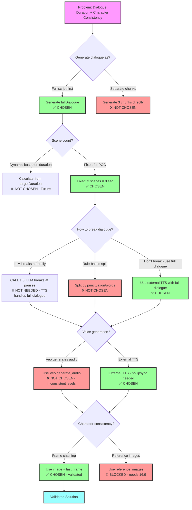

# Solution Decision Tree

**Context**: Addressing dialogue duration and character consistency problems

---

## Decision Tree Diagram



---

## Legend

- ✅ **CHOSEN** - Decision made, moving forward with this
- ❌ **NOT CHOSEN** - Decided against this option
- 🚫 **BLOCKED** - Can't use due to constraints
- ⏸️ **NOT CHOSEN - Future** - Skipping for POC, revisit later
- 🤔 **TBD** - Still deciding between options
- 💡 **Future Option** - Alternative approach to explore later

---

## Decision Summary

### Q1: Generate dialogue as?
**Chosen**: Full script first
**Reason**: Ensures narrative coherence across all scenes

### Q2: Scene count?
**Chosen**: Fixed (3 scenes × 8 sec)
**Reason**: Keep POC simple, dynamic scenes is future enhancement

### Q3: How to break dialogue?
**Chosen**: Don't break dialogue (use external TTS with full dialogue)
**Reason**: With external TTS (Q4), we can use full 15-20s dialogue without breaking. Video clips are visual only.
**Alternative**: If Veo audio is used, need LLM to break dialogue into 8s chunks

### Q4: Voice generation?
**Chosen**: External TTS (generate_audio: false)
**Reason**: Manual testing revealed Veo audio has inconsistent levels between clips. External TTS provides consistent voice/levels across entire video.
**Trade-off**: More complex workflow, but better quality

### Q5: Character consistency?
**Chosen**: Frame chaining (image + last_frame)
**Validated**: ✅ Manual testing confirmed this works
**Blocked**: Reference images (requires 16:9, we need 9:16)

---

## Manual Testing Findings

**Date**: October 20, 2025
**Test**: Generated 2 scenes using frame chaining on Replicate Veo 3.1 UI

### What We Tested
1. Scene 1: Generated with dialogue prompt
2. Scene 2: Generated using Scene 1's last frame as `image` parameter

### Key Findings

#### ✅ Frame Chaining Works (with precise extraction)
- **Initial test (manual screenshot)**:
  - Character consistency: ✅ Maintained
  - Setting consistency: ✅ Maintained
  - Transition quality: ⚠️ Slight lighting variation noticeable

- **Improved test (programmatic frame extraction)**:
  - Used ffmpeg to extract exact last frame: `ffmpeg -i scene1.mp4 -vf "select='eq(n,191)'" -frames:v 1 last_frame.jpg`
  - Result: ✅ **Perfect visual continuity** - no lighting differences
  - **Conclusion**: Precise frame extraction is critical for seamless transitions

#### ⚠️ Pose Continuity Problem Discovered
- Scene 1 can end in any random pose (e.g., cup at mouth, hand mid-gesture)
- Scene 2 starts from that pose + tries to speak dialogue
- Result: Awkward transitions (person with cup at mouth trying to speak)
- **Solution**: Use `last_frame` parameter to force scenes to end in neutral speaking pose

#### ❌ Veo Audio Has Inconsistent Levels
- Each scene generates audio independently
- Volume/voice quality varies between clips
- Noticeable audio jumps when clips are combined
- **Conclusion**: Need external TTS for consistent audio

#### ✅ Dialogue Cutoff Confirmed
- Scene 1 dialogue (~40 words): Cut off at "...marriage and kids"
- Scene 2 dialogue (~32 words): Cut off at "...boat as you"
- 8-second limit insufficient for natural dialogue
- **Conclusion**: Either break dialogue OR use external TTS with full dialogue

#### ✅ Simplified Prompts Improve Transitions
- Initial test: Full scene description in prompt (lighting, setting, expression)
- Improved test: Dialogue-only prompt
- Result: 10% better transition quality
- **Reason**: `image` parameter already defines visual context; verbose prompts create conflicts

### Implementation Requirements

Based on testing, the solution requires:

1. **Programmatic frame extraction**: Use ffmpeg to extract exact last frame at precise resolution
2. **Neutral pose management**: Use `last_frame` parameter to control ending poses
3. **External TTS**: Disable Veo audio (`generate_audio: false`) and add TTS separately
4. **Simplified prompts**: For scenes 2-3, use minimal prompts (dialogue only or continuation cues)

---

## Next Steps

1. ~~**Test frame chaining manually**~~ → ✅ COMPLETED - Frame chaining validated
2. ~~**Decide Q3 and Q4**~~ → ✅ COMPLETED - External TTS chosen, no dialogue breaking needed
3. **Design neutral pose approach** → Determine how to generate/extract neutral speaking pose
4. **Implement frame chaining in pipeline** → Update video-generator.ts with `image`/`last_frame` parameters
5. **Integrate external TTS** → Add TTS generation step (ElevenLabs, OpenAI TTS, etc.)

---

## Alternative Approach: Video Extension (Veo 3.1)

**Status**: 💡 **Future Option** - Not available in Replicate API

### What It Is
Veo 3.1 (via Gemini API) supports **video extension**:
- Generate initial video (8 seconds)
- Extend by +7 seconds up to 20 times
- Output is single continuous video (not separate clips)

### How It Would Work
```
1. Generate Scene 1 (8 sec)
   prompt: "Person saying: 'I know that fear feels overwhelming.'"

2. Extend with Scene 2 (+7 sec)
   video: Scene 1 output
   prompt: "Continue. Person saying: 'You're not alone.'"

3. Extend with Scene 3 (+7 sec)
   video: Scene 1+2 output
   prompt: "Continue. Person saying: 'God's love is constant.'"

Output: One 22-second continuous video
```

### Benefits Over Frame Chaining
✅ **Solves dialogue continuity** - No scene breaks, one continuous video
✅ **Solves character consistency** - Extension continues same video, guaranteed same character
✅ **Simpler output** - Platform gets 1 file instead of 3 clips to stitch
✅ **No breaking dialogue needed** - Can use full natural dialogue flow

### Drawbacks
❌ **Not available in Replicate API** - Would require switching to Gemini API
❌ **Requires API migration** - video-generator.ts rewrite
❌ **Different authentication** - New API keys, different pricing
❌ **Fixed +7 sec extension** - Less flexible than choosing 4/6/8 sec

### Decision
**Defer to future** - Document as alternative if frame chaining doesn't work well enough

### When to Reconsider
- If frame chaining produces poor character consistency
- If dialogue breaks feel too jarring
- If willing to migrate from Replicate to Gemini API

---

## Final Validated Solution Summary

**Status**: ✅ Tested and validated via manual Replicate testing

### Architecture

```
User Problem
    ↓
CALL 1: Generate fullDialogue (OpenAI)
    ↓
CALL 2: Generate 3 scene prompts (OpenAI)
    ↓
Generate Scene 1 (Veo 3.1)
  - prompt: Scene 1 content
  - generate_audio: false
  - last_frame: neutral_pose.jpg
    ↓
Extract last frame programmatically (ffmpeg)
    ↓
Generate Scene 2 (Veo 3.1)
  - prompt: Scene 2 content (dialogue only)
  - image: scene1_last_frame.jpg
  - generate_audio: false
  - last_frame: neutral_pose.jpg
    ↓
Extract last frame programmatically (ffmpeg)
    ↓
Generate Scene 3 (Veo 3.1)
  - prompt: Scene 3 content (dialogue only)
  - image: scene2_last_frame.jpg
  - generate_audio: false
  - last_frame: neutral_pose.jpg
    ↓
Combine 3 video clips (silent)
    ↓
Generate TTS audio from fullDialogue (ElevenLabs/OpenAI)
    ↓
Overlay audio on combined video
    ↓
Final 24-second video with consistent character & audio
```

### Key Technical Details

1. **Precise frame extraction**: Use ffmpeg with exact frame number: `ffmpeg -i scene.mp4 -vf "select='eq(n,191)'" -frames:v 1 last_frame.jpg` (for 24fps 8s video)

2. **Neutral pose management**: Generate or extract a neutral speaking pose image, use as `last_frame` parameter to ensure all scenes end in speaking-ready position

3. **Simplified prompts**: Scene 2 & 3 use dialogue-only prompts since `image` parameter provides visual context

4. **External TTS**: Generate full dialogue as single audio track for consistent voice/levels

### Open Questions

1. **Neutral pose generation**: How to create initial neutral_pose.jpg?
   - Option A: Extract middle frame from Scene 1
   - Option B: Text-to-image generation before video pipeline
   - Option C: Accept random poses, regenerate if awkward

2. **TTS provider**: Which service?
   - ElevenLabs (high quality, $)
   - OpenAI TTS (good quality, cheaper)
   - Google Cloud TTS (cheaper, less natural)

3. **Audio sync**: How to time TTS to video?
   - Manual timing in video editor
   - Programmatic audio stretching/compression
   - Let platform handle it

---

See `workflow-problems-and-solutions.md` for full context.
