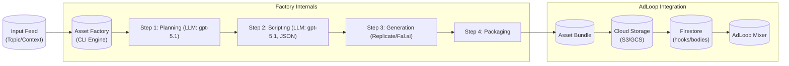

# Content Asset Factory (ContentLoops) Architecture

## 1. Executive Summary
The **Content Asset Factory (ContentLoops)** is a headless generation engine designed to supply high-quality, structured media assets to the **AdLoop Platform**. 

Unlike V1, which focused on end-to-end video creation, ContentLoops focuses on generating the **raw ingredients** (Video Layers + Overlay Data) that AdLoop's "Mixer" combines into final ads.

## 2. Core Philosophy
*   **Supplier Model:** The system does not "make ads". It "supplies assets" (Hooks, Bodies, Data) to AdLoop.
*   **Unified Pipeline:** All content (whether a 3s Hook or a 45s Comic Story) is treated as an **Asset**. The logic is defined by the **Asset Template** (which itself is configurable), and the destination is defined by the **Manifest**.
*   **Code-Driven Control:** We replace "conversational" LLM prompts with strict **JSON Schemas** and **Code Assembly** to ensure constraints (like specific visual blocks) are respected.

## 3. High-Level Architecture



## 4. Component Definitions

### 4.1. The Engine (CLI)
*   **Role:** Job runner and state manager.
*   **Input:** `batch_jobs.json` as an **execution queue** containing job definitions (e.g., `[{"template": "comic-book", "profile": "kids-app", "topic": "David and Goliath"}, {"template": "visual-hook", "profile": "shock-face", "topic": "Surprised Person"}]`).
*   **Capabilities:**
    *   **Queue Management:** Processes jobs in parallel or sequence.
    *   **Resumability:** Saves `state.json` after every step to recover from crashes.

### 4.2. The Asset Template System ("The Blueprints")
An **Asset Template** in ContentLoops is a TypeScript class implementing the `AssetTemplate` interface. It's designed for **config-driven variations** (referred to as "Profiles" or "Flavors") within a single logical asset type, rather than creating separate template classes for every variation.

```typescript
interface AssetTemplate {
  id: string; // e.g., "comic-book"
  type: "hook" | "body"; // Default destination for ingestion
  
  // Config: Defines variations (e.g., layout, narration, style, image model)
  config: AssetTemplateConfig; // A Zod schema will define this, loaded from a profile

  // Steps (Methods implemented by the class)
  plan(topic: string): Promise<Plan>;
  script(plan: Plan): Promise<Script>;
  generate(script: Script): Promise<Assets>; // Produces images only for now
  package(assets: Assets, profile: string): Promise<OutputBundle>; // New method for multi-target output
}

interface AssetTemplateConfig { 
  // Example config for ComicBookTemplate
  panelsPerPage: number;
  includeNarration: boolean;
  artStyle: string;
  imageModel: string;
  outputTargets: Array<"app" | "adloop">; // Defines which packagers to run
  // ... other configurable parameters
}
```

**Key Asset Templates (Classes):**
1.  **`ComicBookTemplate`:** Generates a set of images (e.g., 3-5 comic pages) and associated Narration Data.
    *   **Profiles (Config Variations):** 
        *   `kids-app`: `{ artStyle: "cute", includeNarration: true, outputTargets: ["app"] }`
        *   `standard-app`: `{ artStyle: "realistic", includeNarration: true, outputTargets: ["app"] }`
        *   `ad-campaign`: `{ artStyle: "action", includeNarration: true, outputTargets: ["adloop"] }`
2.  **`VisualHookTemplate`:** Generates a single high-impact image (or short video in future) suitable for a Hook.
    *   **Profiles (Config Variations):** 
        *   `shock-face`: `{ mood: "surprised", subject: "person", outputTargets: ["adloop"] }`
        *   `generic-cta`: `{ mood: "uplifting", subject: "text", outputTargets: ["adloop"] }`

### 4.3. The Service Layer
*   **LLMService:** 
    *   **Model:** `gpt-5.1` or `gpt-5.1-mini` (Default: `gpt-5.1`).
    *   **Feature:** Enforces `zod` schemas for all outputs to ensure strict JSON generation. No free-text parsing.
*   **ImageGenService:** 
    *   **Provider:** Replicate or Fal.ai (direct API calls initially).
    *   **Logic:** Maps the Template's "Visual Description" to specific model inputs (`prompt`, `negative_prompt`, `style`, etc.). ComfyUI integration is deferred to a future iteration.
*   **AudioGenService (New):** 
    *   **Provider:** ElevenLabs (for voiceovers).
    *   **Logic:** Converts narration text into MP3 audio files.
*   **ComfyUIService (Deferred):**
    *   **Future:** Will handle complex node graph orchestration. Not in scope for initial release.


### 4.4. The Output Artifact ("The Bundle")
Every job produces a standardized folder structure ready for ingestion, with multiple potential bundles per generation.

```text
/output/david-goliath/
├── manifest.json       # The "Passport" for AdLoop (defines content type, asset paths)
├── assets/
│   ├── page_1.png
│   ├── page_2.png
│   └── hook_intro.mp4 (Optional, if generated)
├── data/
│   └── overlays.json   # Text strings for AdLoop overlays
└── app-bundle/         # Example output bundle for App (if configured)
    ├── story-data.json 
    ├── thumbnail.jpg
    └── voice.mp3 (If generated)
```

## 5. AdLoop Integration Strategy
The **ContentLoops** system bridges the gap via **DataSources**.

1.  **Generation:** ContentLoops creates the core Asset Bundle.
2.  **Packaging:** For each `outputTarget` in the job config, a specific packager runs.
    *   `AdLoopPackager`: Creates `manifest.json`, uploads assets, and registers them in Firestore.
    *   `AppPackager`: Creates `story-data.json`, `thumbnail.jpg`, `voice.mp3`, etc.
3.  **Consumption:** AdLoop's `MyVideoMixAutoTemplate` picks up new IDs and mixes them, while the App directly consumes its structured bundles.

```