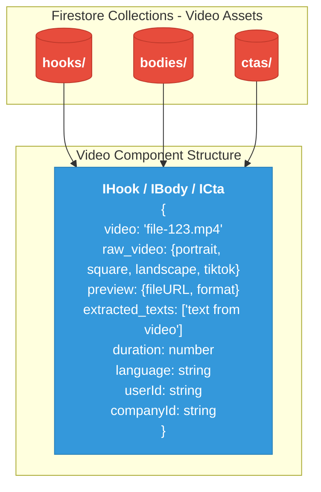
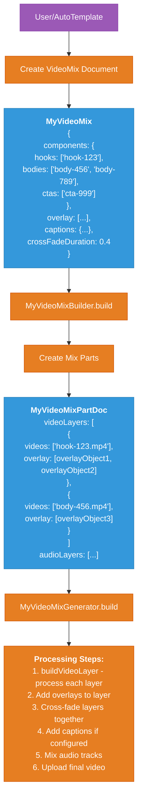
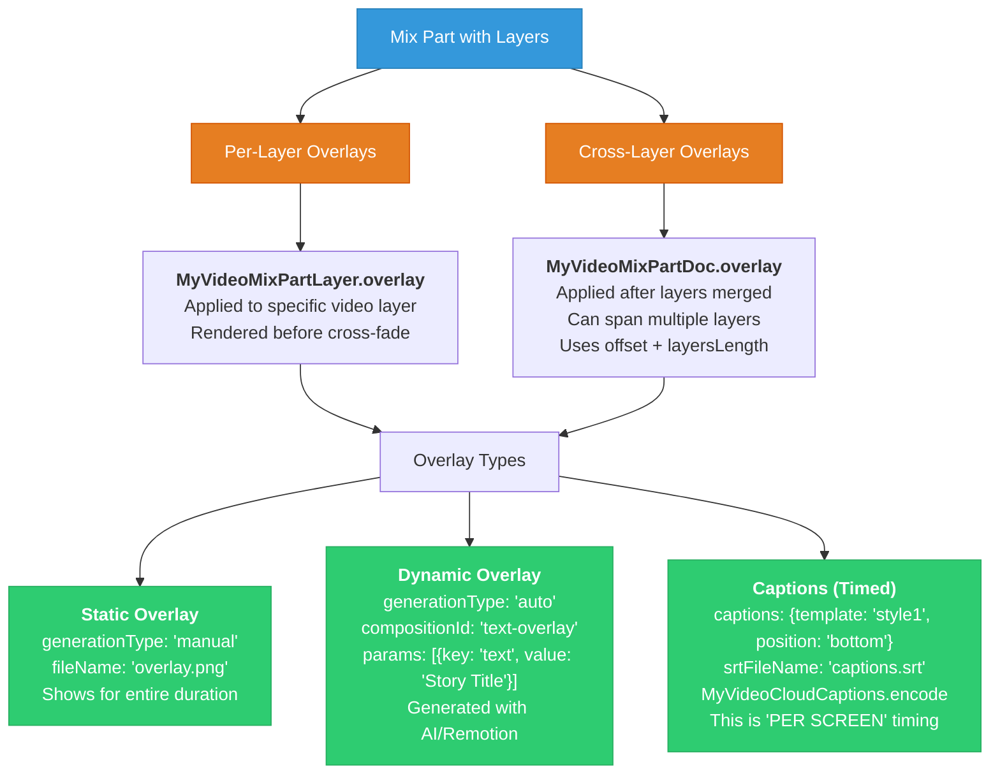
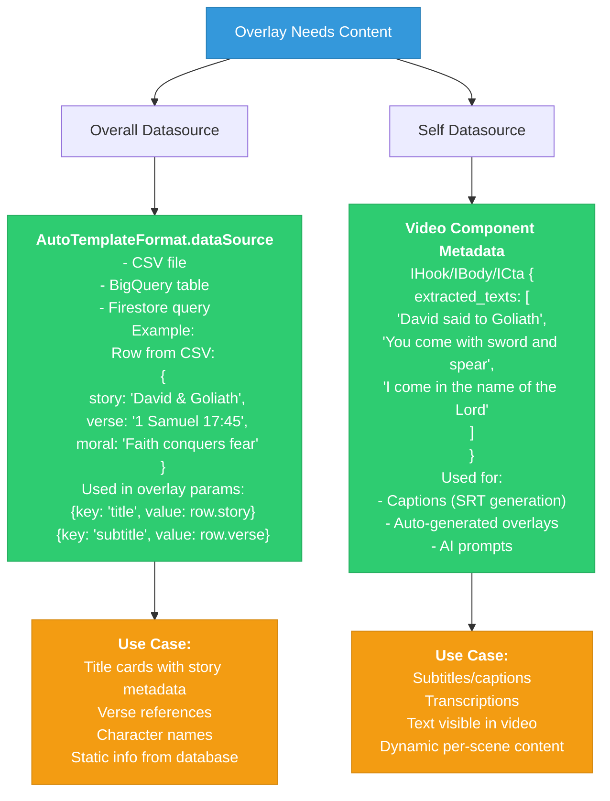

# AdLoops Technical Implementation - Detailed Reference

## Overview

This document provides detailed technical diagrams showing how AdLoops works internally, with separate views for each major component and process.

---

## 1. Data Structure - Components Are Just Video Files



**Key Point:** There's no "baked overlay" flag. They're all just video files with metadata.

---

## 2. Mix Creation - Where Overlays Are Defined



**Key Point:** Overlays are defined at mix/part level, not stored with the component.

---

## 3. Overlay Processing - Two Types



**Key Points:**
- Not all overlays are "per screen" - only captions/timed overlays
- Overlays can be static (whole video) or timed (specific timestamps)
- `generationType` determines if it's pre-made or AI-generated

---

## 4. Content Generation Flow - AutoTemplates

```mermaid
graph TD
    AutoTemplate["`**AutoTemplateFormat**
    {
      dataSource: 'bible-stories-csv',
      prompt: 'Generate comic for {story}',
      interval: 86400,
      fields: [
        {
          type: 'video',
          collection: 'bodies',
          conditions: [...]
        }
      ]
    }`"]

    Schedule[Scheduled Trigger<br/>Every interval seconds]

    Schedule --> AutoTemplate

    AutoTemplate --> FetchData[Fetch from DataSource<br/>CSV/BigQuery/Firestore]

    FetchData --> Row["`Data Row:
    {
      story: 'David & Goliath',
      verse: '1 Samuel 17',
      character: 'David'
    }`"]

    Row --> AIGenerate[AI Generation<br/>OpenAI/Replicate]

    AIGenerate --> GeneratedVideo[Generated Video File]

    GeneratedVideo --> UploadComponent[Upload to Collection]

    UploadComponent --> BodiesCollection[(bodies/)]

    BodiesCollection --> RegularComponent["`Now it's a regular component:
    {
      video: 'david-goliath-generated.mp4',
      extracted_texts: [...],
      ...
    }`"]

    RegularComponent --> UsedInMixes[Used in VideoMixes<br/>like any other component]

    classDef templateNode fill:#9b59b6,stroke:#8e44ad,color:#fff
    classDef processNode fill:#e67e22,stroke:#d35400,color:#fff
    classDef collectionNode fill:#e74c3c,stroke:#c0392b,color:#fff
    classDef componentNode fill:#3498db,stroke:#2980b9,color:#fff

    class AutoTemplate templateNode
    class Schedule,FetchData,AIGenerate,GeneratedVideo,UploadComponent processNode
    class BodiesCollection collectionNode
    class Row,RegularComponent,UsedInMixes componentNode
```



**Key Point:** "GENERATED vs ASSET" is a workflow distinction. Once generated, it's just another video component.

---

## 5. Complete Processing Pipeline - Actual Code Flow

```mermaid
graph TD
    Start[User or AutoTemplate]

    Start --> Step1["`**1. Create/Trigger VideoMix**
    Status: 'new'
    Firestore: videoMixes/`"]

    Step1 --> Trigger1[Firebase Trigger:<br/>onCreateMixes]

    Trigger1 --> Step2["`**2. Build Mix Structure**
    MyVideoMixBuilder.build
    - Load template format
    - Resolve component IDs
    - Generate combinations
    - Create parts`"]

    Step2 --> Step3["`**3. Create Mix Parts**
    Firestore: videoMixes/{id}/parts/
    Status: 'new'
    Each part = one video output`"]

    Step3 --> Trigger2[Firebase Trigger:<br/>onCreateMixPart]

    Trigger2 --> Step4["`**4. Queue Worker Task**
    Pub/Sub: ProcessVideoMix
    Worker pool processes part`"]

    Step4 --> Step5["`**5. Generate Video**
    MyVideoMixGenerator.build

    For each videoLayer:
      - MyVideoCloudReEncoder (trim/offset)
      - MyVideoOverlayFactory (add overlays)

    Cross-fade all layers:
      - MyVideoCrossFadeVideos

    Add cross-layer overlays:
      - MyVideoOverlayFactory

    Add captions (if configured):
      - MyVideoCloudCaptions (SRT file)

    Mix audio:
      - MyVideoCloudAudioMix
    `"]

    Step5 --> Step6["`**6. Upload Result**
    - Upload to Cloud Storage
    - Create document in videos/
    - Update part status: 'uploaded'`"]

    Step6 --> Step7["`**7. Check Mix Complete**
    If all parts uploaded:
      - Update mix status: 'ready'
      - Trigger experiment if configured`"]

    classDef userNode fill:#9b59b6,stroke:#8e44ad,color:#fff
    classDef stepNode fill:#3498db,stroke:#2980b9,color:#fff
    classDef triggerNode fill:#e74c3c,stroke:#c0392b,color:#fff
    classDef processNode fill:#e67e22,stroke:#d35400,color:#fff

    class Start userNode
    class Step1,Step2,Step3,Step6,Step7 stepNode
    class Trigger1,Trigger2 triggerNode
    class Step4,Step5 processNode
```



---

## 6. Data Sources - Where Overlay Content Comes From



---

## Comparison: Conceptual vs Technical

| Aspect | Conceptual Model | Technical Implementation |
|--------|------------------|-------------------------|
| **Component Types** | "Baked Overlay" vs "Asset With Overlay" | All are just video files (`IHook/IBody/ICta`) |
| **Where Overlays Defined** | At component level | At mix/part level (`MyVideoMix.overlay`) |
| **GENERATED vs ASSET** | Component attribute | Workflow distinction (AutoTemplate → generates → becomes component) |
| **SELF OVERLAY** | Separate path | Just... don't add overlays if video is complete |
| **PER SCREEN** | Required step for all overlays | Only for captions/timed overlays (`MyVideoCloudCaptions`) |
| **Overlay Types** | PRE-MADE vs GENERATED | `generationType: "manual" \| "auto"` (exact match ✅) |
| **Data Sources** | Overall vs Self | `AutoTemplateFormat.dataSource` vs `extracted_texts` (exact match ✅) |

---

## Key TypeScript Interfaces

```typescript
// Component - Just a video file
interface IHook {
  video: string;
  raw_video: {
    portrait: MyAdPreview;
    square: MyAdPreview;
    landscape: MyAdPreview;
    tiktok: MyAdPreview;
  };
  preview: MyAdPreview;
  extracted_texts: string[];  // SELF DATASOURCE
  duration: number;
}

// Mix - Defines how to combine components
interface MyVideoMix {
  components: {
    hooks: string[];
    bodies: string[];
    ctas: string[];
  };
  overlay: MyVideoMixOverlay[];      // Overlays defined here
  captions?: MyVideoMixCaptions;      // Caption config
  crossFadeDuration: number;
}

// Part - One output video
interface MyVideoMixPartDoc {
  videoLayers: MyVideoMixPartLayer[];  // Each layer has overlays
  audioLayers: MyVideoMixAudioLayer[];
  overlay: MyVideoMixOverlayObject[];  // Cross-layer overlays
  srtFileName?: string;                // For captions
}

// Layer - One component in the sequence
interface MyVideoMixPartLayer {
  videos: string[];                    // Component IDs
  overlay?: MyVideoMixOverlayObject[]; // Per-layer overlays
  offset?: number;
  maxLength?: number;
}

// Overlay Object - Applied during generation
interface MyVideoMixOverlayObject {
  fileName?: string;                   // Static overlay file
  compositionId?: string;              // Remotion composition
  generationType?: "manual" | "auto"; // PRE-MADE vs GENERATED
  params?: MyVideoMixOverlayParam[];  // Data for overlay
  offset?: number;                    // When to apply
  layersLength?: number;              // How many layers it spans
}

// Auto Template - Triggers generation
interface AutoTemplateFormat {
  dataSource: string;                  // OVERALL DATASOURCE
  prompt: string;                      // AI generation prompt
  interval: number;                    // Seconds between runs
  fields: TemplateFormatField[];
}
```

---

## Processing Code References

```typescript
// Main generation flow
class MyVideoMixGenerator {
  async buildVideoLayers() {
    // For each layer
    for (const layer of this.part.videoLayers) {
      // 1. Re-encode/trim video
      const reencoded = await MyVideoCloudReEncoder.encode();

      // 2. Add per-layer overlays
      for (const overlay of layer.overlay) {
        reencoded = await MyVideoOverlayFactory.encode(overlay);
      }
    }

    // 3. Cross-fade layers together
    for (const nextLayer of remainingLayers) {
      merged = await MyVideoCrossFadeVideos.run();
    }

    // 4. Add cross-layer overlays
    for (const overlay of this.part.overlay) {
      merged = await MyVideoOverlayFactory.encode(overlay);
    }

    // 5. Add captions (if configured)
    if (this.part.captions) {
      merged = await MyVideoCloudCaptions.encode(srtFile);
    }

    // 6. Mix audio
    for (const audio of this.part.audioLayers) {
      merged = await MyVideoCloudAudioMix.encode();
    }

    // 7. Upload
    await uploadToCloudStorage(merged);
  }
}
```

---

## Code File Locations

### Data Models
- `/Ads_Platform_Web/models/videos.ts` - Video component interfaces
- `/ads-library-automation/functions/src/videomixes/models.ts` - Mix/overlay models

### Processing Classes
- `/ads-library-automation/functions/src/videomixes/MyVideoMixBuilder.ts` - Mix structure builder
- `/ads-library-automation/functions/src/videomixes/MyVideoMixGenerator.ts` - Video generation orchestrator
- `/ads-library-automation/functions/src/videomixes/MyVideoCloudReEncoder.ts` - Video trimming/offsetting
- `/ads-library-automation/functions/src/videomixes/overlays/MyVideoOverlayFactory.ts` - Overlay application
- `/ads-library-automation/functions/src/videomixes/MyVideoCloudCaptions.ts` - Caption/subtitle rendering
- `/ads-library-automation/functions/src/videomixes/MyVideoCrossFadeVideos.ts` - Layer cross-fading
- `/ads-library-automation/functions/src/videomixes/MyVideoCloudAudioMix.ts` - Audio mixing

### Triggers
- `/ads-library-automation/functions/src/triggers/onCreateMixes.ts` - Mix creation trigger
- `/ads-library-automation/functions/src/triggers/onCreateMixPart.ts` - Part processing trigger

---

*Based on AdLoops codebase analysis - 2025-11-24*
