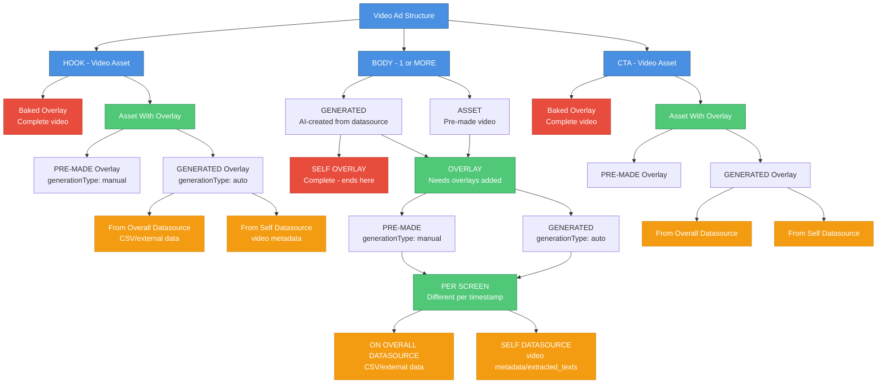

# AdLoops Video Ad Structure

## Complete Video Ad Structure

```mermaid
graph TD
    Start[Video Ad Structure]

    Start --> Hook[HOOK - Video Asset]
    Start --> Body[BODY - 1 or MORE]
    Start --> CTA[CTA - Video Asset]

    %% HOOK Structure
    Hook --> HookBaked[Baked Overlay<br/>Complete video]
    Hook --> HookAsset[Asset With Overlay]

    HookAsset --> HookPreMade[PRE-MADE Overlay<br/>generationType: manual]
    HookAsset --> HookGenerated[GENERATED Overlay<br/>generationType: auto]

    HookGenerated --> HookOverall[From Overall Datasource<br/>CSV/external data]
    HookGenerated --> HookSelf[From Self Datasource<br/>video metadata]

    %% BODY Structure (VALIDATED)
    Body --> BodyGenerated[GENERATED<br/>AI-created from datasource]
    Body --> BodyAsset[ASSET<br/>Pre-made video]

    BodyGenerated --> BodySelfOverlay[SELF OVERLAY<br/>Complete - ends here]
    BodyGenerated --> BodyOverlay[OVERLAY<br/>Needs overlays added]
    BodyAsset --> BodyOverlay

    BodyOverlay --> BodyGiven[PRE-MADE<br/>generationType: manual]
    BodyOverlay --> BodyGenOverlay[GENERATED<br/>generationType: auto]

    BodyGiven --> PerScreen[PER SCREEN<br/>Different per timestamp]
    BodyGenOverlay --> PerScreen

    PerScreen --> PerScreenOverall[ON OVERALL DATASOURCE<br/>CSV/external data]
    PerScreen --> PerScreenSelf[SELF DATASOURCE<br/>video metadata/extracted_texts]

    %% CTA Structure
    CTA --> CTABaked[Baked Overlay<br/>Complete video]
    CTA --> CTAAsset[Asset With Overlay]

    CTAAsset --> CTAPreMade[PRE-MADE Overlay]
    CTAAsset --> CTAGenerated[GENERATED Overlay]

    CTAGenerated --> CTAOverall[From Overall Datasource]
    CTAGenerated --> CTASelf[From Self Datasource]

    %% Styling
    classDef primaryNode fill:#4a90e2,stroke:#2e5c8a,color:#fff
    classDef convergeNode fill:#50c878,stroke:#2e8b57,color:#fff
    classDef dataNode fill:#f39c12,stroke:#d68910,color:#fff
    classDef endNode fill:#e74c3c,stroke:#c0392b,color:#fff

    class Start,Hook,Body,CTA primaryNode
    class HookAsset,BodyOverlay,PerScreen,CTAAsset convergeNode
    class HookOverall,HookSelf,PerScreenOverall,PerScreenSelf,CTAOverall,CTASelf dataNode
    class HookBaked,BodySelfOverlay,CTABaked endNode
```
