# Workflow Problems and Proposed Solutions

**Date**: October 16, 2025
**Status**: Brainstorming / Design Phase
**Context**: Post-Cycle 2 Implementation - Discovered bottlenecks with Veo 3 video generation

---

## Current System Overview

**Pipeline**:
- Dataset (userProblem + category) → Script Generation (2 LLM calls) → Video Generation (Veo 3.1)
- Outputs: 3 video clips per video (8 seconds each)
- Template focus: **direct-to-camera** (person speaking to viewer)

**See**: `cycle-2/1-requirements.md` for full implementation details

---

## Problems Identified

### 1. Dialogue Duration Mismatch
**Problem**: Generated dialogue exceeds 8-second video clip duration
- Natural conversational dialogue: ~15-30 seconds
- Veo 3.1 hard limit: 4, 6, or 8 seconds per clip
- Result: Dialogue gets cut off mid-sentence

**Example**:
```
Generated: "I know the fear of losing someone you're falling for feels
            overwhelming, like standing on unstable ground"

Duration: ~10 seconds to speak naturally
Veo Limit: 8 seconds max
Result: ❌ Cut off mid-sentence
```

### 2. Character & Scene Consistency
**Problem**: Each clip generated independently - different person/setting across scenes
- Scene 1: Person A in Living Room 1
- Scene 2: Person B in Living Room 2
- Scene 3: Person C in Different Room
- No scene-to-scene continuity

**Root Cause**: Each Veo 3 generation is independent with no reference to previous clips

### 3. Interrelated Problems
These problems compound:
- Need 3 clips for narrative flow
- But each clip break interrupts dialogue continuity
- And character changes between clips break immersion

---

## Constraints

### Hard Constraints
- ✅ Keep 9:16 aspect ratio (vertical video for mobile)
- ✅ Veo 3.1 duration limits: 4, 6, or 8 seconds only
- ✅ Focus on direct-to-camera template (text-visuals has different challenges)
- ❌ Can't use `reference_images` (only works with 16:9, we need 9:16)

### Veo 3.1 Available Parameters
From schema:
- `prompt` (required)
- `image` - Input image to start from ✅ **Can use this**
- `last_frame` - Ending image for interpolation ✅ **Can use this**
- `duration` - 4, 6, or 8 seconds
- `aspect_ratio` - 16:9 or 9:16
- `generate_audio` - true/false
- `seed` - For reproducibility
- `negative_prompt` - Exclude elements

---

## Solutions Discussed

### Decision Tree

```mermaid
flowchart TD
    Start[Problem: Dialogue Duration + Character Consistency]

    Start --> Q1{Generate dialogue as?}
    Q1 -->|Full script first| FullDialogue[Generate fullDialogue<br/>CHOSEN]
    Q1 -->|Separate chunks| Chunks[Generate 3 chunks directly<br/>NOT CHOSEN]

    FullDialogue --> Q2{Scene count?}
    Q2 -->|Dynamic based on duration| Dynamic[Calculate from targetDuration<br/>NOT CHOSEN - Future]
    Q2 -->|Fixed for POC| Fixed[Fixed: 3 scenes × 8 sec<br/>CHOSEN]

    Fixed --> Q3{How to break dialogue?}
    Q3 -->|LLM breaks naturally| LLM[CALL 1.5: LLM breaks at pauses<br/>OPTION A - TBD]
    Q3 -->|Rule-based split| Rules[Split by punctuation/words<br/>OPTION B - TBD]

    LLM --> Q4{Voice generation?}
    Rules --> Q4
    Q4 -->|Veo generates audio| VeoAudio[Use Veo generate_audio<br/>SIMPLER - TBD]
    Q4 -->|External TTS + Lipsync| External[ElevenLabs + Wav2Lip<br/>MORE COMPLEX - TBD]

    VeoAudio --> Q5{Character consistency?}
    External --> Q5
    Q5 -->|Frame chaining| Chain[Use image + last_frame<br/>CHOSEN]
    Q5 -->|Reference images| Ref[Use reference_images<br/>BLOCKED: needs 16:9]

    Chain --> End[Final Flow]
```



### Key Decisions Made

**✅ Decided:**
1. Generate full dialogue first (ensures narrative coherence)
2. Fixed 3 scenes × 8 seconds for POC (skip dynamic scene count)
3. Use frame chaining (image + last_frame) for character consistency

**⏸️ Still Deciding:**
1. How to break dialogue into scenes (LLM vs rule-based)
2. Voice generation approach (Veo audio vs external TTS+lipsync)

---

## Proposed New Flow

### High-Level Pipeline

```
1. Input: userProblem + template

2. CALL 1: Generate Content
   Output:
   - overallScript (video concept)
   - fullDialogue (complete 20-30 sec speech)

3. CALL 1.5: Break Dialogue into Scenes
   Output: For each of 3 scenes:
   - scenes[].dialogue (chunk of fullDialogue, ~8 sec)
   - scenes[].visualDescription (DOP instructions)

4. CALL 2: Generate Prompts
   Output:
   - scenes[].prompt (Veo 3 optimized, includes dialogue)

5. Video Generation with Frame Chaining:
   Scene 1: Generate → extract last_frame
   Scene 2: Use Scene 1's last_frame as input → extract last_frame
   Scene 3: Use Scene 2's last_frame as input
```

### Detailed Flow

**Step 1: Generate Content (CALL 1)**
```
Input:
  - userProblem: "Being scared that the guy I'm falling for is going to leave me"
  - template: "direct-to-camera"

Output:
  - overallScript: "A video addressing relationship anxiety and fear of
                    abandonment. Opens with validation of the viewer's fears.
                    Transitions to reassurance. Concludes with message about
                    God's constant love."

  - fullDialogue: "I know that fear of losing someone you're falling for feels
                   overwhelming. You're not alone in feeling this way. God's
                   love is constant and will never leave you."
```

**Step 2: Break Dialogue (CALL 1.5)**
```
Input: fullDialogue

Output (3 scenes):
  Scene 1:
    dialogue: "I know that fear of losing someone you're falling for feels overwhelming."
    visualDescription: "Person in 30s, warm living room, facing camera.
                        Concerned expression, open body language. Close-up."

  Scene 2:
    dialogue: "You're not alone in feeling this way."
    visualDescription: "Same person, transitioning to gentle reassuring expression.
                        Slight lean forward, warm and encouraging."

  Scene 3:
    dialogue: "God's love is constant and will never leave you."
    visualDescription: "Same person, peaceful uplifting expression.
                        Confident, hopeful demeanor."
```

**Step 3: Generate Prompts (CALL 2)**
```
Input: scenes[].dialogue + scenes[].visualDescription + template rules

Output:
  Scene 1 prompt: "Close-up of warm empathetic person in their 30s sitting in
                   cozy living room, facing camera, saying: 'I know that fear
                   of losing someone you're falling for feels overwhelming.'
                   Concerned but warm expression, open body language, natural
                   window light."

  Scene 2 prompt: "Same person from previous scene, gentle reassuring expression,
                   saying: 'You're not alone in feeling this way.' Slight lean
                   forward, warm and encouraging, intimate framing."

  Scene 3 prompt: "Same person, peaceful uplifting expression, saying: 'God's love
                   is constant and will never leave you.' Confident hopeful
                   demeanor, inspiring atmosphere."
```

**Step 4: Video Generation with Frame Chaining**
```
Scene 1:
  {
    prompt: <Scene 1 prompt>,
    image: null,
    duration: 8,
    aspect_ratio: "9:16",
    generate_audio: true
  }
  → Generate video
  → Extract last_frame_1

Scene 2:
  {
    prompt: <Scene 2 prompt>,
    image: last_frame_1,  ← Start from Scene 1's ending
    duration: 8,
    aspect_ratio: "9:16",
    generate_audio: true
  }
  → Generate video
  → Extract last_frame_2

Scene 3:
  {
    prompt: <Scene 3 prompt>,
    image: last_frame_2,  ← Start from Scene 2's ending
    duration: 8,
    aspect_ratio: "9:16",
    generate_audio: true
  }
  → Generate video
```

---

## Expected Benefits

### Dialogue Duration
✅ Full dialogue ensures narrative coherence
✅ Natural breaks prevent mid-sentence cuts
✅ Each scene fits 8-second limit

### Character Consistency
✅ Frame chaining provides visual reference
✅ Scene 2 starts where Scene 1 ended
✅ Scene 3 starts where Scene 2 ended
✅ Should maintain same person/setting

---

## Known Unknowns / Risks

### 1. Dialogue Timing Accuracy
**Unknown**: Can CALL 1.5 accurately estimate ~8 seconds of spoken dialogue?
- "You're not alone" = 2 seconds or 4 seconds?
- Depends on speaking pace, which varies

**Mitigation**: Test and iterate on prompts

### 2. Frame Chaining Effectiveness
**Unknown**: Will last_frame → image actually maintain character consistency?
- Last frame might be mid-blink, bad expression
- Veo might still drift despite reference
- No guarantees from Veo docs

**Mitigation**: Test with real generation, see results

### 3. Audio Continuity
**Unknown**: Will voice tone/quality be consistent across clips?
- Each clip's audio generated independently by Veo
- Might sound choppy at transitions

**Mitigation**:
- Test Veo audio quality first (simpler)
- If bad, explore external TTS + lipsync (more complex)

### 4. Performance
**Known**: Sequential generation = slower
- Must generate Scene 1 → extract frame → generate Scene 2 → etc.
- Can't parallelize
- ~3-5 minutes per video (3 sequential Veo calls)

**Mitigation**: Accept for POC, optimize later if needed

---

## Implementation Changes Required

### New Components Needed

**CALL 1.5: Dialogue Breaker**
- New method in script-generator.ts
- Input: fullDialogue + scenesCount
- Output: scenes[].dialogue + scenes[].visualDescription
- Implementation: LLM call or rule-based (TBD)

**Frame Extraction**
- Extract last frame from Veo video output
- Store temporarily for next scene
- Location: video-generator.ts

**Sequential Scene Generation**
- Modify video generation loop
- Pass previous scene's last_frame to next scene
- Track frame references in state

### Modified Components

**CALL 1 (script-generator.ts)**
- Add fullDialogue to output
- Update systemPromptCall1 to generate both overallScript + fullDialogue

**CALL 2 (script-generator.ts)**
- Update to handle scenes[].dialogue instead of scenes[].content
- Update systemPromptCall2 to incorporate dialogue into prompts

**Video Generator (video-generator.ts)**
- Add image parameter support
- Sequential processing instead of parallel
- Frame extraction logic

**Types (script.types.ts)**
- Update Scene interface:
  - Add `dialogue` field
  - Keep or rename `content` to `visualDescription`

---

## Open Questions

### Technical
1. **CALL 1.5 Implementation**: LLM vs rule-based for breaking dialogue?
   - LLM = More accurate natural pauses, but adds cost/latency
   - Rule-based = Faster/cheaper, but might break awkwardly

2. **Voice Generation**: Veo audio vs external TTS?
   - Veo = Simpler workflow, less control
   - External TTS + lipsync = More complex, better quality/consistency?

3. **Frame Format**: What image format does Veo expect?
   - URL to hosted image?
   - Base64 encoded?
   - Need to test

### Product
1. **Is 3 × 8 seconds enough** for meaningful content?
2. **Will transitions feel natural** or jarring?
3. **Does frame chaining actually work** well enough for production?

---

## Next Steps

### Phase 1: Validation (Before Implementation)
1. Test Veo 3.1 frame chaining manually
   - Generate Scene 1
   - Extract last frame
   - Generate Scene 2 with Scene 1's last_frame as image
   - Evaluate character consistency

2. Test dialogue timing
   - Generate sample fullDialogue
   - Manually break into chunks
   - Estimate speaking time
   - Validate 8-second fit

### Phase 2: Implementation (If Validation Passes)
1. Implement CALL 1.5 (dialogue breaker)
2. Update CALL 1 to generate fullDialogue
3. Update CALL 2 to use scenes[].dialogue
4. Implement frame extraction
5. Modify video generation for sequential + frame chaining
6. Test end-to-end with one video

### Phase 3: Iteration
1. Review generated video quality
2. Identify issues
3. Iterate on prompts/logic
4. Consider alternative approaches if needed

---

## Alternative Approaches (If This Doesn't Work)

### Video Extension (Veo 3.1 via Gemini API)
**Status**: 💡 **Future Option** - Not currently available in Replicate API

**What It Is**:
- Veo 3.1 (via Gemini API) supports extending videos by +7 seconds up to 20 times
- Output is single continuous video (not separate clips)

**How It Would Work**:
```
1. Generate Scene 1 (8 sec)
   prompt: "Person saying: 'I know that fear feels overwhelming.'"

2. Extend Scene 1 with Scene 2 (+7 sec)
   video: Scene 1 output
   prompt: "Continue. Person saying: 'You're not alone.'"

3. Extend with Scene 3 (+7 sec)
   video: Scene 1+2 output
   prompt: "Continue. Person saying: 'God's love is constant.'"

Result: One 22-second continuous video
```

**Benefits**:
- ✅ Solves dialogue continuity - No scene breaks, one video
- ✅ Solves character consistency - Extension guaranteed same character
- ✅ Simpler output - Platform gets 1 file instead of 3 clips
- ✅ No dialogue breaking needed - Can use full natural flow

**Drawbacks**:
- ❌ Requires migrating from Replicate API to Gemini API
- ❌ Different authentication, pricing model
- ❌ Fixed +7 sec extension (less flexible)
- ❌ Requires video-generator.ts rewrite

**When to Consider**:
- If frame chaining produces poor character consistency
- If dialogue breaks feel too jarring
- If willing to migrate APIs

---

### If Frame Chaining Fails
- Switch to 16:9 to use reference_images
- Use different model with better consistency (RunwayML, Pika, etc.)
- Generate single longer clip with different model, then chunk
- **Try Video Extension approach** (requires Gemini API migration)

### If Dialogue Timing Fails
- Use external TTS to control exact timing
- Generate videos without dialogue, add lipsync post-process
- Simplify to shorter, safer dialogue chunks
- **Try Video Extension approach** (no breaking needed)

### If Audio Quality Is Poor
- External TTS (ElevenLabs) + lipsync (Wav2Lip)
- Separate audio/video generation entirely

---

## Related Documents

- **Cycle 2 Implementation**: `_docs/1_development-docs/cycle-2/`
- **Current Flow Diagram**: See cycle-2 mermaid diagrams
- **Veo 3.1 Schema**: `_docs/2_reference-docs/veo3-schema.json`

---

## Summary

**Problem**: Dialogue too long + character inconsistency across clips
**Primary Solution**: Full dialogue → intelligent breaks + frame chaining (Replicate API)
**Alternative Solution**: Video Extension (Gemini API - future option)
**Status**: Design phase, ready for validation testing
**Risk Level**: Medium (unknowns around timing accuracy and frame chaining effectiveness)
**Recommendation**: Test frame chaining manually before full implementation; keep Video Extension as backup if frame chaining doesn't work
