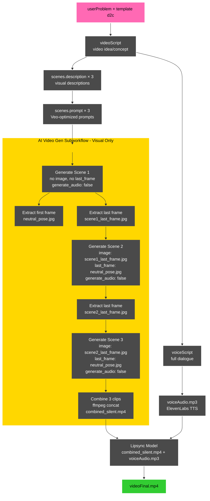

# Video Generation Workflow v1

**Date**: October 20, 2025
**Status**: Draft - Pending finalization

---

## Workflow Diagram

---

## Workflow Fields

### Inputs
- `userProblem` - User's problem data from CSV
- `template` - Template type (e.g., "direct-to-camera")

### Script Generation (CALL 1)
- `videoScript` - Overall video concept/synopsis
- `voiceScript` - Full dialogue (20-24 seconds)
- `scenes[].description` - Visual scene descriptions (x3)

### Prompt Generation (CALL 2)
- `scenes[].prompt` - Veo-optimized prompts (x3)

### TTS Generation
- `voiceAudio.mp3` - Generated audio file from voiceScript

### AI Video Gen Subworkflow - Scene 1
- `scene1.mp4` - First video clip (8s, silent)
- `neutral_pose.jpg` - First frame extraction
- `scene1_last_frame.jpg` - Last frame extraction

### AI Video Gen Subworkflow - Scene 2
- `scene2.mp4` - Second video clip (8s, silent)
- `scene2_last_frame.jpg` - Last frame extraction

### AI Video Gen Subworkflow - Scene 3
- `scene3.mp4` - Third video clip (8s, silent)

### Video Assembly
- `combined_silent.mp4` - All 3 clips combined (24s, no audio)

### Lipsync
- `videoFinal.mp4` - Final video with synced audio

---

## Key Design Decisions

### AI Video Gen Subworkflow Scope
**Boundary**: Starts after `scenes[].prompt` generation, ends with `combined_silent.mp4`

**Purpose**: Visual generation only
- Takes prompts as input
- Generates video clips with frame chaining
- Outputs combined silent video

**Rationale**: Clean separation of concerns. Lipsync remains at main pipeline level as the convergence point where audio and video streams merge.

### Neutral Pose Strategy
**Approach**: Extract first frame from Scene 1
- Scene 1 generates without constraints
- First frame extracted as `neutral_pose.jpg`
- Used as `last_frame` parameter for Scenes 2 & 3

**Rationale**: First frame is Veo's initial state, likely most neutral/stable

### Frame Chaining
**Method**: Sequential generation with `image` parameter
- Scene 2 starts from Scene 1's last frame
- Scene 3 starts from Scene 2's last frame
- All scenes end in neutral pose (except Scene 1)

**Result**: Perfect visual continuity with precise frame extraction

### Audio Strategy
**Approach**: External TTS with lipsync
- Veo audio disabled (`generate_audio: false`)
- TTS generates full dialogue separately
- Lipsync model syncs audio to video

**Rationale**:
- Veo audio has inconsistent levels between clips
- External TTS provides consistent voice/levels
- No need to break dialogue into chunks

---

## Open Questions

1. **Lipsync model**: Which provider/approach?
2. **Dialogue in prompts**: Do we need it if lipsync handles mouth movement? (Requires testing)
3. **Prompt simplification**: How minimal should Scene 2-3 prompts be?
4. **Veo prompting guidelines**: What specific guidance to include in LLM calls?

---

## Next Steps

1. Finalize API call grouping and structure
2. Update schema with new fields (`videoScript`, `voiceScript`, renamed fields)
3. Create mock script.json with all fields
4. Define testing plan
5. Update templates with Veo 3.1 guidelines

---

## Related Documents

- **Manual Testing Findings**: `solution-decision-tree.md`
- **Dry-Run Implementation**: `../1_development-docs/cycle-3/IMPLEMENTATION-COMPLETE.md`
- **Veo 3.1 Schema**: `veo3.1-schema.json`
