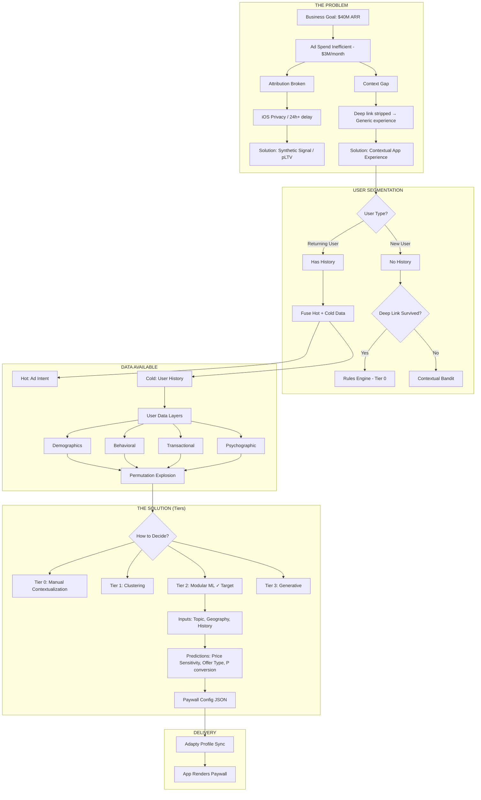
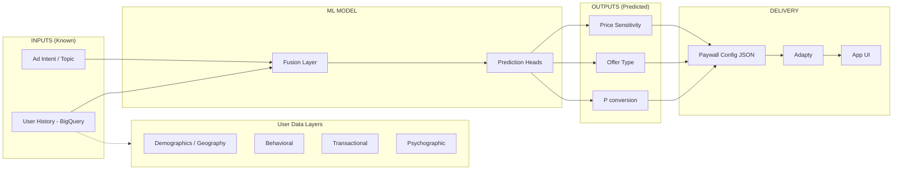
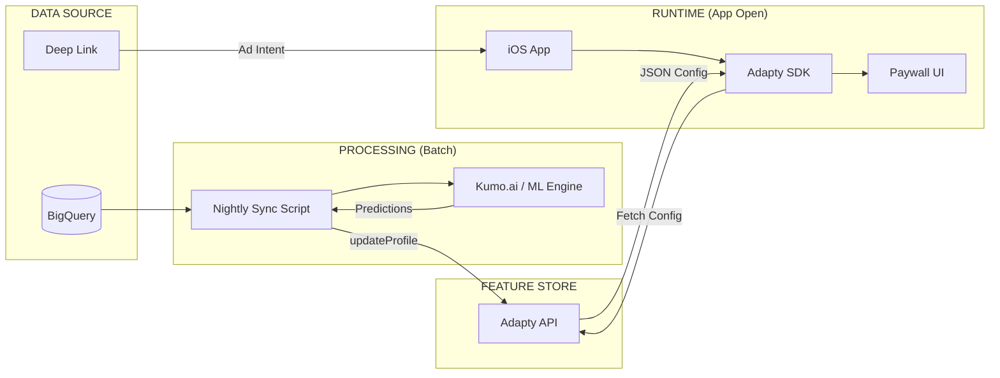
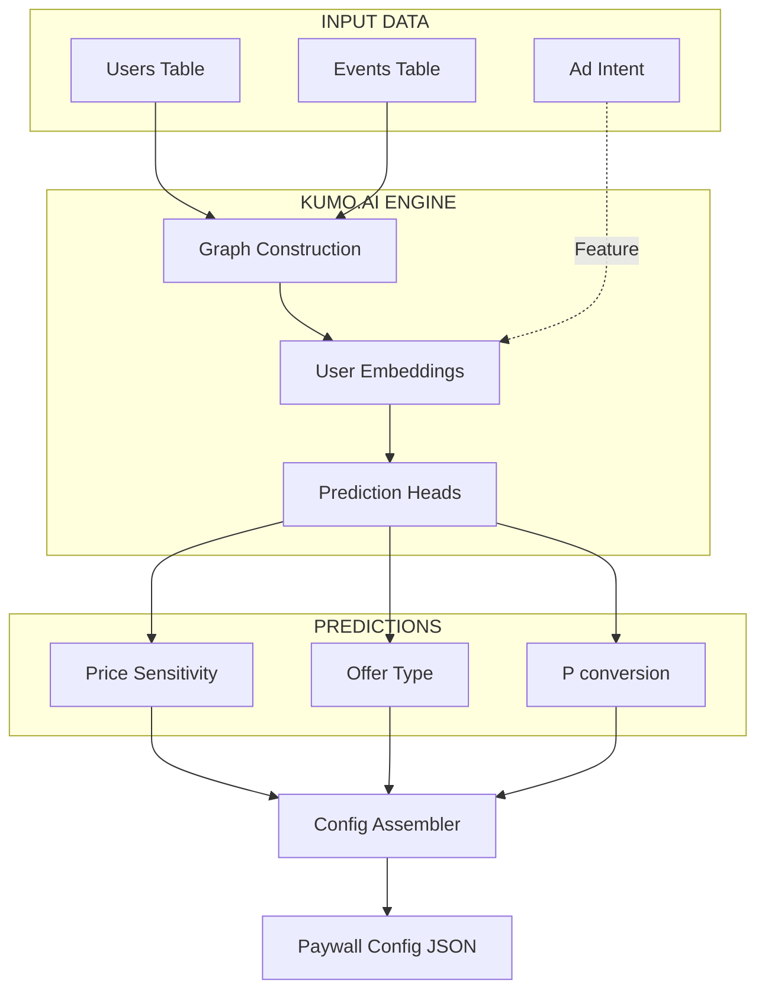

# The Mind-Reading Engine: Strategy Document v3

**Project:** Real-Time Contextual Personalization
**Goal:** $40M ARR, Optimize $3M/month Ad Spend

---

## 1. The Mission & The Gap

### The Business Goal
Hit $40M ARR by scaling ad spend to $3M/month efficiently.

### The Problems

**1. Attribution Breakdown (iOS Privacy)**
- Apple's ATT framework hides user identifiers
- **Two different delays exist:**
  - **SKAN postbacks:** 24-48h+ delay for *attributed* install signals (which ad caused the install)
  - **CAPI events:** ~30 min delay for *raw* event delivery (user started trial, purchased)
- Ad networks need both: fast events AND attribution to optimize spend
- Result: We're flying blind on which ads produce high-value users

**2. Context Gap (Ad Intent Lost)**
- User clicks specific ad (e.g., "Sleep Prayers")
- Deep link context often stripped during install (iOS privacy)
- App shows generic "Welcome" screen
- Result: Mismatch between what user wanted and what they see → low conversion

### The Permutation Problem

We have rich user data, but too many variables to manually map:

| User Data Layer | Examples |
|------------|----------|
| Demographics | Age, gender, geography, language |
| Behavioral | Content viewed, habits, streaks, time of use |
| Transactional | Past purchases, price points, offer types |
| Intent | Ad clicked, deep link params |
| Psychographic | Life challenge, preferred topics, denomination |

5 geographies × 4 topics × 3 price tiers × 2 offer types = **120+ combinations**

We can't manually build 120 screens. We need a system that:
1. Takes what we know about the user
2. Predicts the optimal configuration
3. Assembles the right experience

### The Opportunity

- **Millions of users** with behavioral history in BigQuery
- **Rich event data** (BCEvents schema) tracking engagement patterns
- **Adapty infrastructure** for dynamic paywall delivery
- This data is "cold" and disconnected — we need to activate it

> **Funnel Reality Check (Dec 2025):** Trial → Paid conversion is ~40% (US). This is higher than typical assumptions. The bottleneck is earlier in funnel (paywall → trial), not trial → paid. Global rates TBD.

---



---

## 2. The Inventory

### Data Assets

**BigQuery (User History)**
- Millions of users with behavioral history
- BCEvents schema tracks: habits, content views, chat interactions, purchases, aha moments
- Reference: `app_event_schema.md`

**Key Event Categories:**
| Category | Events | Signal |
|----------|--------|--------|
| Engagement | `habitDone`, `dayDone`, `studyItemDone` | Activity patterns |
| Content | `bibleScreen`, `audioListenStart`, `studyScreen` | Topic preferences |
| AI Chat | `askChatGPT` (with category) | Intent signals |
| Mood | `spiritualMeterDone` | Psychographic data |
| Conversion | `paywallShown`, `purchaseCompleted` | Transaction history |
| Aha Moments | `ahaBedtimeStories`, `ahaGuidedBreathing`, etc. | High-value engagement |

**Deep Links (Ad Intent)**
- Campaign, source, ad_id, keyword
- Hot signal — real-time intent if not stripped

### Tools Validated

**Kumo.ai (ML Engine)**
- Graph Neural Network for relational data (User → Events)
- KumoRFM + LocalGraph works with pandas DataFrames
- Free tier: 1,000 API queries/day
- Zero-training capability for relational data

**Adapty (Delivery)**
- `updateProfile` API for server-side attribute sync
- Visual Builder for paywall templates
- AdaptyUI renders configs automatically
- Remote Config for JSON payloads
- No Redis needed — Adapty acts as feature store/cache

### Research Findings

**pLTV / Synthetic Signal**
- Industry standard 2025 solution for iOS attribution delays
- Predict user value at Minute 5, send to Facebook CAPI
- **Key insight (Dec 2025 research):**
  - CAPI delivers raw events in ~30 min (via AdLoops)
  - SKAN postbacks still take 24-48h+ for attributed signals
  - pLTV remains valuable: gives Meta fast "this user looks valuable" signal before SKAN attribution arrives
  - SKAN serves as delayed ground truth for calibration

**Latency**
- Adapty profile fetch: <200ms (CDN cached)
- Acceptable for real-time personalization

---

## 3. The Solution

### Two-Pronged Strategy

**Prong 1: Synthetic Signal (Marketing)**
- Problem: Ad networks need conversion signals, but iOS delays them 24+ hours
- Solution: Predict user value at Minute 5, send to Facebook CAPI immediately
- Result: Ad algorithm optimizes faster without waiting for trial → paid conversion

**Prong 2: Contextual Router (Product)**
- Problem: Generic app experience doesn't match user intent
- Solution: ML predicts optimal paywall config from user data
- Result: Right paywall for right user → higher conversion

### User Segmentation

| User Type | Data Available | Approach | PoC Scope? |
|-----------|----------------|----------|------------|
| **New User** | Ad intent only (if deep link survives) | Rules Engine (Tier 0) or Contextual Bandit | No |
| **Returning User** | Ad intent + History | ML Prediction (Tier 2) | **Yes** |

### Inputs vs Outputs

The ML system has a clear separation between what we **know** and what we **predict**:

**Inputs (Known Signals)**
| Input | Source | Notes |
|-------|--------|-------|
| Topic / Intent | Ad deep link | What ad they clicked (sleep, anxiety, bible study) |
| User History | BigQuery | Behavioral patterns, past purchases, demographics (incl. geography) |

**Outputs (Predictions)**
| Prediction | Output | Used For |
|------------|--------|----------|
| Price Sensitivity | High / Low | Which price tier to show |
| Offer Type | Monthly / Annual | Which subscription to push |
| P(conversion) | 0.0 - 1.0 | Confidence score, ranking |

### The Fusion Logic

For returning users, we combine hot and cold signals:

```
Ad Intent (hot) ─────┐
                     ├──→ ML Model ──→ Predictions ──→ Paywall Config
User History (cold) ─┘
```

- **Hot signal available:** Topic from ad intent, ML predicts price/offer
- **Hot signal missing:** ML can infer topic from history as fallback

### Result: Paywall Config

The system outputs a config JSON that drives the app experience:

```json
{
  "topic": "sleep",
  "price_tier": "low",
  "offer": "monthly",
  "confidence": 0.82
}
```

App assembles the paywall from this config.

---



---

## 4. The Architecture (Tiers)

We define four strategic tiers, progressing from simple to sophisticated:

### Tier 0: Manual Contextualization (No ML)

**What:** Hard-coded rules for top ad campaigns

**How:**
```
IF deep_link.campaign = "sleep" → Show Sleep Paywall
IF deep_link.campaign = "anxiety" → Show Anxiety Paywall
```

**When to use:**
- Immediate wins (top 5 ad campaigns)
- Fallback when ML unavailable
- New users with surviving deep link

**Pros:** Fast, safe, no infrastructure needed
**Cons:** Doesn't scale, misses nuance

---

### Tier 1: Clustering (Batch ML)

**What:** ML groups users into segments, each mapped to a pre-made paywall

**How:**
1. Run clustering algorithm (K-Means / unsupervised) on BigQuery data nightly
2. Algorithm finds "blobs" of similar users based on behavior patterns
3. Assign users to clusters: "Cluster A", "Cluster B", etc.
4. Human manually maps clusters to paywalls: "Cluster A looks like anxious night owls → Anxiety Paywall"

**Output:** Single label (Cluster ID)

**Example Clusters Discovered:**
- Cluster A: "Anxious Night Owls" — US-based, female, use app at 11 PM, read Psalms
- Cluster B: "Power Parents" — 30-40s, high retention, click "Kids" ads, buy annual
- Cluster C: "Casual Browsers" — Low engagement, bounces quickly

**The Problem with Clustering:**
- It finds users who are *similar* to each other
- It does NOT predict who will *buy*
- You still have to guess: "Cluster A probably wants Anxiety Paywall" — that's a human assumption, not a prediction
- No conversion probability — you don't know if showing Anxiety Paywall to Cluster A actually works

**Pros:** Uses ML, manageable variations (5-10), good for exploration
**Cons:** Doesn't predict conversion, requires manual mapping, misses individual nuance

---

### Tier 2: Modular (Multi-Head ML) ← **PoC Target**

**What:** ML predicts multiple attributes per user, system assembles optimal paywall config

**The Key Difference from Clustering:**
- Clustering asks: "Who is similar to whom?"
- Tier 2 asks: "If I show Bob this paywall config, will he convert?"

This is **propensity prediction** (supervised), not grouping (unsupervised).

---

#### Inputs (Features)

| Input | Source | Type | Notes |
|-------|--------|------|-------|
| Topic / Intent | Ad deep link | Hot | Campaign, keyword — if not stripped |
| User History | BigQuery | Cold | All user data layers (below) |

**User Data Layers (from BigQuery):**
| Layer | Examples | Signal For |
|-------|----------|------------|
| Demographics | Age, gender, geography, language | Price tier, currency |
| Behavioral | Content viewed, habits, streaks, time of use | Topic affinity |
| Transactional | Past purchases, price points, offer types | Price sensitivity, offer preference |
| Psychographic | Life challenge, preferred topics, denomination | Topic, messaging |

---

#### Outputs (Predictions)

| Prediction Head | Output | Classes | Used For |
|-----------------|--------|---------|----------|
| **Price Sensitivity** | Willingness to pay | High / Low | Which price tier to show |
| **Offer Type** | Subscription preference | Monthly / Annual | Which offer to push |
| **P(conversion)** | Conversion probability | 0.0 - 1.0 | Confidence, ranking |

**Note:** Topic comes from ad intent (input), not predicted. If ad intent missing, can fall back to behavioral signals.

---

#### How It Works

1. **Fusion:** Combine hot signal (ad intent) + cold signal (user history)
2. **Prediction:** Model outputs multiple heads simultaneously
3. **Assembly:** System builds config JSON from predictions
4. **Delivery:** Config sent to Adapty → App renders paywall

---

#### Example: Bob's Flow

**Bob's Profile:**
- Dormant 6 months
- History: Read Psalms, used mood tracker, bought $9.99 monthly before
- Ad clicked: "Sleep Prayers" campaign

**Inputs to Model:**
- Topic: "sleep" (from ad intent)
- Geography: US
- Past purchase: $9.99/month
- Engagement: Low recent, high historical mood tracking

**Model Predictions:**
- Price Sensitivity: **High** (0.82) — bought cheap before, dormant = price conscious
- Offer Type: **Monthly** (0.75) — prefers flexibility
- P(conversion): **0.68** — decent chance if we match config

**Assembled Config:**
```json
{
  "topic": "sleep",
  "price_tier": "low",
  "offer": "monthly",
  "confidence": 0.68
}
```

**Result:** Bob sees Sleep Paywall with $9.99/month offer, not $59.99/year.

---

**Pros:**
- Predicts conversion, not just similarity
- Handles permutations automatically
- Individual-level personalization

**Cons:**
- More complex infrastructure
- Requires training data with conversion outcomes

---

### Tier 3: Generative (Future)

**What:** LLM generates bespoke UI on the fly

**How:**
1. ML predicts user preferences
2. LLM generates custom copy, selects visuals
3. App renders dynamically

**Output:** Fully custom screen per user

**Pros:** Ultimate personalization ("segment of one")
**Cons:** High complexity, requires custom renderer, risky for production

---

### Tier Comparison

| Tier | ML Type | Output | Paywalls | Complexity |
|------|---------|--------|----------|------------|
| 0 | None | Rule match | Pre-made (5) | Low |
| 1 | Clustering | Cluster ID | Pre-made (5-10) | Medium |
| 2 | Multi-head | Attribute JSON | Assembled | Medium-High |
| 3 | Generative | Custom UI | Generated | High |

### Decision: Why Tier 2 for PoC

- **Tier 0/1:** Don't solve the permutation problem
- **Tier 2:** Proves we can predict multiple attributes and assemble configs
- **Tier 3:** Too risky for current timeline

Tier 2 is the minimum viable proof that ML-driven personalization works.

---

## 5. Deep Dive: Tech Stack

### Data Flow Overview



---

### The Brain: Kumo.ai

**Why Kumo:**
- Graph Neural Network — handles relational data (User → Events) natively
- Zero-training capability for relational data
- PQL (Predictive Query Language) for defining prediction targets
- Works with pandas DataFrames via `KumoRFM` + `LocalGraph`

**How It Works:**
1. Load user + events data into `LocalGraph`
2. Define prediction queries (one per head)
3. Model outputs probabilities (0.0 - 1.0)
4. Combine results, pick winners

**Example Prediction Queries:**
```python
# P(conversion): Will user purchase in next 30 days? (binary)
q_conv = "PREDICT COUNT(purchases.*, 0, 30, days) > 0 FOR users.user_id IN (user_ids)"

# Price Sensitivity: Predict average purchase price (regression → threshold to High/Low)
q_price = "PREDICT AVG(purchases.price, 0, 30, days) FOR users.user_id IN (user_ids)"

# Offer Type: Will user purchase annual? (binary, using filtered purchases table)
q_annual = "PREDICT COUNT(annual_purchases.*, 0, 30, days) > 0 FOR users.user_id IN (user_ids)"
```

**Usage pattern (from Kumo docs):**
```python
graph = rfm.LocalGraph.from_data({"users": users_df, "purchases": purchases_df})
model = rfm.KumoRFM(graph)
result = model.predict(query, indices=user_ids, run_mode='fast')
```

> ⚠️ **Note:** PQL syntax above is based on Kumo RFM docs. Exact queries will be refined during implementation. Key insight: WHERE filters feature context, not prediction target.

**Free Tier:** 1,000 API queries/day — sufficient for PoC

---

### The Bridge: Adapty

**Why Adapty:**
- Already integrated in app
- `updateProfile` API for server-side attribute sync
- Acts as feature store — no Redis needed
- Visual Builder for paywall templates
- AdaptyUI renders configs automatically

**Two Modes:**

| Mode | Use Case | API Access | Rendering |
|------|----------|------------|-----------|
| **Visual Builder** | Pre-made templates | No | AdaptyUI (automatic) |
| **Remote Config** | Custom JSON | Yes | Your code (manual) |

**For Tier 2:** Use Visual Builder with audience rules based on synced attributes.

**Sync Flow:**
```python
# Nightly batch script
for user in users_with_predictions:
    adapty.update_profile(
        user_id=user.id,
        custom_attributes={
            "price_sensitivity": user.price_pred,
            "offer_type": user.offer_pred,
            "conversion_score": user.conv_pred
        }
    )
```

> ⚠️ **Verify:** Adapty API syntax above is illustrative. Confirm exact method signatures against Adapty server-side API documentation before implementation.

---

### Latency Handling

**The Challenge:**
- User opens app → needs personalized paywall instantly
- ML prediction might take 200-500ms if done real-time
- Can't show spinner

**The Solution: Pre-compute + Cache**

| Defense | Mechanism | Latency |
|---------|-----------|---------|
| **Primary** | Nightly batch sync → Adapty CDN | <200ms |
| **Secondary** | Splash screen ("Personalizing...") | Buys 1-2s |
| **Fallback** | Local rules (parse deep link) | Instant |

**Flow:**
1. Predictions computed nightly (batch)
2. Synced to Adapty profiles
3. App open → Adapty SDK fetches from CDN (fast)
4. If CDN miss → fall back to deep link rules

---

### ML Stack Diagram



---

### Summary: What We Use

| Component | Tool | Role |
|-----------|------|------|
| Data Warehouse | BigQuery | Store user history, events |
| ML Engine | Kumo.ai | Predict attributes |
| Feature Store | Adapty | Store predictions, serve configs |
| Delivery | Adapty SDK | Fetch config at app open |
| Rendering | AdaptyUI | Display paywall |

**What We Don't Need:**
- ~~Redis~~ — Adapty handles caching
- ~~Custom API~~ — Adapty SDK handles delivery
- ~~Custom renderer~~ — AdaptyUI for Tier 2

---

## 6. PoC: The Bob Scenario

### Objective

Prove that we can:
1. Take a returning user's history + ad intent
2. Predict multiple attributes (Price Sensitivity, Offer Type, P(conversion))
3. Output a paywall config that would convert them

This validates **Tier 2 (Modular)** architecture end-to-end.

### Scope

| In Scope | Out of Scope |
|----------|--------------|
| Returning users | New users (cold start) |
| Synthetic data (mimics BCEvents) | Real BigQuery connection |
| Multi-head prediction | Single-head / clustering |
| Config JSON output | Adapty integration |
| Abstract visualizer | Production UI |

### The Test Case: Bob

> **PoC Note:** Bob uses a **topic-based** ad scenario ("Sleep Prayers") for demonstration clarity. In current production, ads are **feature-based** ("Lockscreen Widget"). The ML architecture is identical — only the input label changes. See "Deep Link Reality" section below.

**Bob's Profile:**
- Status: Dormant 6 months (churned)
- History: Read Psalms, used mood tracker, bought $9.99 monthly before
- Ad clicked: "Sleep Prayers" campaign on Facebook

**The Challenge:**
A generic app shows "Welcome to BibleChat!" — boring, no relevance.

**Expected Output:**
The model should predict:
- Price Sensitivity: **High** (he bought cheap before, dormant = cautious)
- Offer Type: **Monthly** (prefers flexibility)
- P(conversion): ~0.6-0.8 (decent chance with right config)

**Expected Config:**
```json
{
  "topic": "sleep",
  "price_tier": "low",
  "offer": "monthly",
  "confidence": 0.68
}
```

**Result:** Bob sees Sleep Paywall with $9.99/month, not generic $59.99/year.

### PoC Components

#### 1. Data Generation
- Python script generates synthetic `users.csv` + `events.csv`
- Schema mirrors BCEvents (see `app_event_schema.md`)
- ~1,000 users with varying histories
- Embedded correlations (e.g., past cheap purchases → high price sensitivity)
- Test users: Bob, Alice, Charlie with known profiles

#### 2. ML Prediction
- Kumo.ai script loads synthetic data
- Runs prediction queries for each head:
  - Price Sensitivity
  - Offer Type
  - P(conversion)
- Outputs combined predictions per user

#### 3. Config Assembly
- Script takes predictions + ad intent
- Assembles config JSON
- Applies business logic (e.g., high price sensitivity → low price tier)

#### 4. Visualizer
- Simple HTML/CSS page
- Reads config JSON
- Renders abstract paywall (colored blocks, not real design)
- Proves: Data → Prediction → Visual Output

### Success Criteria

| Criteria | Validation |
|----------|------------|
| Kumo runs predictions | No errors, outputs probabilities |
| Multi-head output | 3 predictions per user (not just 1) |
| Bob's predictions make sense | High price sensitivity, monthly, decent P(conv) |
| Config JSON valid | Matches expected schema |
| Visualizer renders | Shows different paywall based on config |

### What This Proves

1. **Data Viability:** User history predicts conversion-relevant attributes
2. **Tech Viability:** Kumo handles relational data without manual feature engineering
3. **Architecture Viability:** Multi-head prediction → config assembly works
4. **Tier 2 Validity:** Modular approach is feasible

### What This Doesn't Prove (Yet)

- Real-world prediction accuracy (needs real data)
- Latency in production
- Adapty integration
- Actual conversion lift

Those come after PoC, with real BigQuery data.

---

## 7. Deep Link Reality (Dec 2025)

### Current Ad Strategy

Ads have shifted from **topic-based** ("Sleep Prayers", "Anxiety Relief") to **feature-based** ("Lockscreen Widget", "Daily Verse Widget"). This affects how we interpret "ad intent."

### Deep Link Structure

Deep links are **task queues**, not simple metadata. Example decoded payload:

```json
{
  "tasks": [
    {
      "type": "webOnboarding",
      "match": ["98c64971-00ff-4ce5-80db-e5d8249dfa21"]
    },
    {
      "type": "launchInAppOnboardingPlacement",
      "match": ["ios_lock_screen_widget_in_app", "lock_screen_widget_in_app"]
    },
    {
      "type": "onboarding",
      "match": ["chapters.widget.promoting.onboarding.v9_12"]
    },
    {
      "type": "trackCampaign",
      "match": ["Biblechat Daily Testing - Adv+ ABO US - IOS"]
    }
  ]
}
```

**What the deep link controls:**
- Which onboarding flow to show (`onboarding`)
- Which feature placement to highlight (`launchInAppOnboardingPlacement`)
- Campaign tracking (`trackCampaign`)

**What the deep link does NOT control:**
- Price tier
- Offer type (weekly/monthly/yearly)
- Paywall copy or visuals

### Where ML Fits

The deep link already implements **Tier 0** (rules-based routing). ML augments this by adding **paywall personalization**:

```
Current (Tier 0):
Deep link tasks → App executes → Fixed onboarding → Fixed paywall

With ML (Tier 2):
Deep link tasks → App executes → Fixed onboarding → ML-personalized paywall
                                                    (price, offer, config)
```

**ML's role is narrow but high-value:** Decide the paywall configuration (price sensitivity, offer type) while the deep link handles feature routing.

### Supported Task Types (from codebase)

| Task Type | Purpose |
|-----------|---------|
| `webOnboarding` | Web user import |
| `launchInAppOnboardingPlacement` | In-app onboarding flows |
| `onboarding` | Trigger specific onboarding variant |
| `showPaywall` | Display specific paywall placement |
| `trackCampaign` | Attribution tracking |
| `freePremium` | Grant free trial |
| `openFeature` | Generic feature trigger |

---

## 8. Open Questions

### Adapty Personalization (Info Request)

The app calls `Adapty.getPaywall(placementId)` and Adapty returns the config. What's NOT visible in the codebase:

- Are there audience segments based on user attributes?
- Are topics synced to Adapty profiles via `updateProfile`?
- What A/B tests are running on paywalls?

**Action needed:** Check Adapty dashboard to understand current personalization layer.

### Topics in Current System

From codebase analysis:
- **Topics collected:** During onboarding (salvation, love, discipline, faith, sin)
- **Topics used for:** Content personalization (study plans, daily tasks)
- **Topics NOT used for:** Paywall selection (in app code)

Topics may be driving paywall personalization via Adapty audience rules — needs verification.

---
