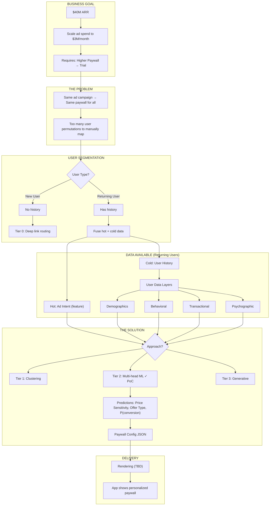
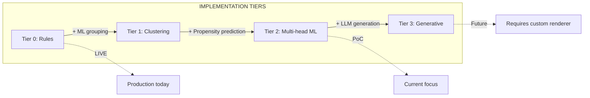
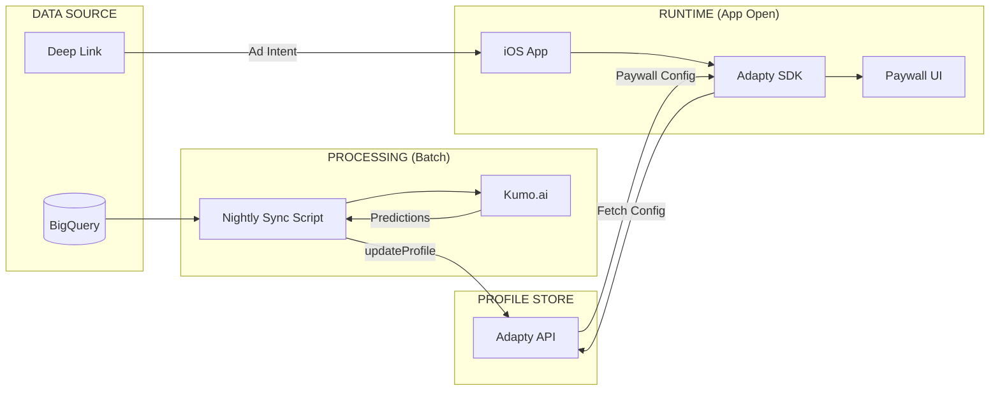
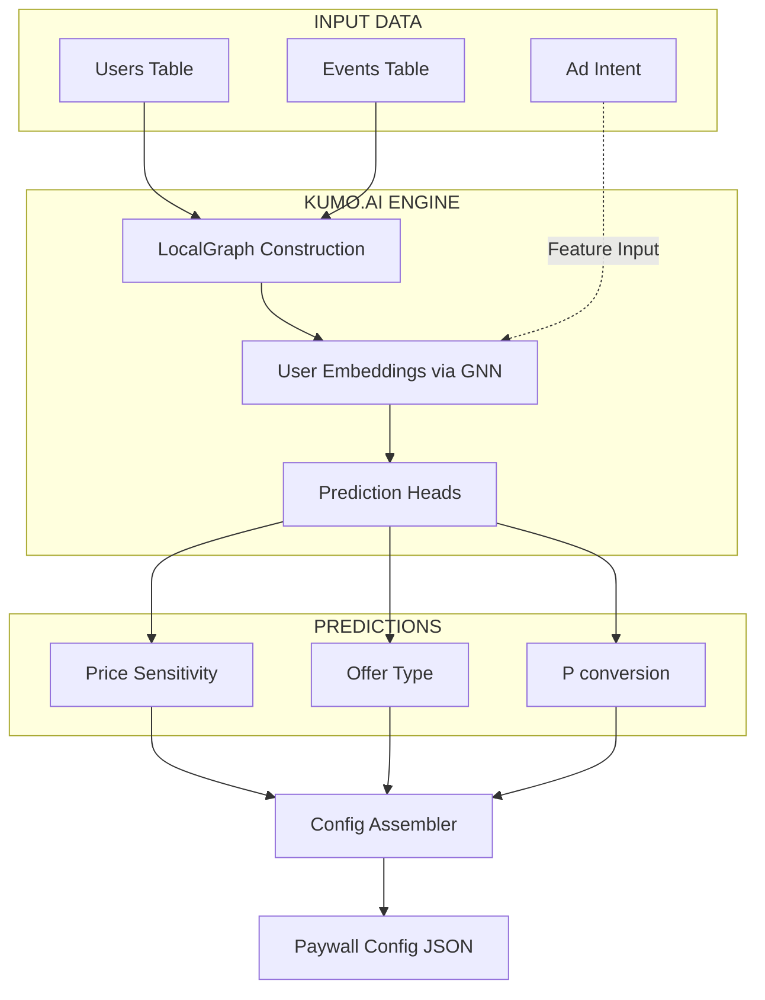

# Strategy Document v4: ML-Powered Paywall Personalization

**Project:** Contextual Paywall Personalization for Returning Users
**Goal:** Improve Paywall→Trial conversion via ML-driven config selection

---

## 1. Mission & Gap

### The Business Goal

Hit $40M ARR by scaling ad spend to $3M/month efficiently.

### The Lever

**Paywall→Trial conversion for returning users.**

- Trial→Paid is ~40% (US) — high, not the bottleneck
- The drop-off happens earlier: users see paywall, don't start trial
- Returning users have history we're not using

### The Problem: Permutation Explosion

We have rich data about users, but too many variables to manually map:

| Data Layer | Examples |
|------------|----------|
| Demographics | Age, gender, geography, language |
| Behavioral | Content viewed, habits, streaks, time of use |
| Transactional | Past purchases, price points, offer types |
| Intent | Ad clicked (feature-based: lockscreen, widget) |
| Psychographic | Life challenge, preferred topics, denomination |

**The math:**
- 5 geographies × 4 intent signals × 3 price tiers × 2 offer types = **120+ combinations**
- Add age groups, denominations, engagement levels → **thousands of permutations**

We can't manually build paywalls for every combination. Today, same ad campaign → same paywall for everyone, regardless of individual history.

### Why ML

The permutation problem requires a system that:

1. Takes what we know about the user (history + ad intent)
2. Predicts the optimal paywall configuration
3. Assembles the right experience automatically

ML handles the combinatorial complexity that manual rules cannot.

### The Opportunity

- **Millions of users** with behavioral history in BigQuery
- **Rich event data** (BCEvents schema) tracking engagement patterns
- **Adapty** manages paywalls today (22 placements) — rendering approach TBD
- This data is "cold" and disconnected — ML activates it



---

## 2. The Inventory

What we have to work with.

### Data Assets

**BigQuery (User History)**
- Millions of users with behavioral history
- BCEvents schema tracks engagement patterns
- Access: Pending (PoC used synthetic data)

**Key Event Categories:**

| Category | Events | Signal |
|----------|--------|--------|
| Engagement | `habitDone`, `dayDone`, `studyItemDone` | Activity patterns |
| Content | `bibleScreen`, `audioListenStart`, `studyScreen` | Content preferences |
| AI Chat | `askChatGPT` (with category) | Intent signals |
| Mood | `spiritualMeterDone` | Psychographic data |
| Conversion | `paywallShown`, `purchaseCompleted` | Transaction history |
| Aha Moments | `ahaBedtimeStories`, `ahaGuidedBreathing`, etc. | High-value engagement |

**Deep Links (Ad Intent)**
- Feature-based: lockscreen, widget, daily verse
- Delivered via task queue (base64-encoded JSON)
- Survives iOS install flow (confirmed)

### Tools

**Kumo.ai (ML Engine)**
- Graph Neural Network for relational data (User → Events)
- KumoRFM + LocalGraph works with pandas DataFrames
- Free tier: 1,000 API queries/day
- Status: Validated in PoC

**Adapty (Paywall Management)**
- 22 placements configured
- `updateProfile` API for server-side attribute sync
- Visual Builder for templates, Remote Config for JSON
- Status: In production, rendering approach TBD

### What PoC Validated

| Component | Status |
|-----------|--------|
| Kumo loads relational data | ✓ Works |
| Multi-head prediction | ✓ Works |
| Config assembly | ✓ Works |
| P(conversion) accuracy | ⚠ Needs fix (predicts engagement, not conversion) |
| Real BigQuery connection | Not tested |
| Adapty sync | Not tested |

---

## 3. User Segmentation

Two user types, two different data situations:

| User Type | Data Available | Current State | ML Opportunity |
|-----------|----------------|---------------|----------------|
| **New User** | Ad intent only | Tier 0 (deep link routing) | Limited — no history for individual personalization |
| **Returning User** | Ad intent + history | Same as new user | **High — history enables personalization** |

### New Users (Out of Scope)

- **What we have:** Ad intent from deep link (feature-based: lockscreen, widget)
- **What we don't have:** Behavioral history
- **Current state:** Tier 0 is live — deep link task queue routes to specific placement
- **Challenge:** No history means no individual personalization. Same ad → same experience for all new users.

Future options for new users: contextual bandit, lookalike modeling. Not PoC scope.

### Returning Users (PoC Scope)

- **What we have:**
  - **Hot signal:** Ad intent (which ad brought them back)
  - **Cold signal:** Full user history in BigQuery (events, purchases, preferences)
- **Current state:** History is ignored — they get the same experience as new users
- **Opportunity:** Fuse hot + cold signals to personalize paywall config

**Why returning users first:**
1. We have data to work with (no cold start)
2. They already showed intent by returning — higher baseline conversion potential
3. Proves the ML architecture before tackling harder cold-start problem

---

## 4. The Solution

### Core Idea

For returning users, fuse two signals to predict optimal paywall config:

```
Ad Intent (hot) ─────┐
                     ├──→ ML Model ──→ Predictions ──→ Paywall Config
User History (cold) ─┘
```

### Inputs (What We Know)

| Input | Source | Type | Examples |
|-------|--------|------|----------|
| Ad Intent | Deep link | Hot | Feature clicked (lockscreen, widget, daily verse) |
| User History | BigQuery | Cold | Past purchases, engagement patterns, preferences |

**User history layers (from BCEvents):**
- Demographics: age, gender, geography, language
- Behavioral: content viewed, habits, streaks, time of use
- Transactional: past purchases, price points, offer types
- Psychographic: life challenge, preferred topics, denomination

### Outputs (What We Predict)

| Prediction | Output | Used For |
|------------|--------|----------|
| Price Sensitivity | High / Low | Which price tier to show |
| Offer Type | Monthly / Annual | Which billing cycle to push |
| P(conversion) | 0.0 - 1.0 | Confidence score, ranking |

**Key insight:** Feature/intent comes from the ad (INPUT), not predicted. ML predicts *how* to convert them, not *what* they clicked on — the ad already told us that.

### Result: Paywall Config

The system outputs a config that drives paywall selection:

```json
{
  "intent": "lockscreen",
  "price_tier": "low",
  "offer": "monthly",
  "confidence": 0.72
}
```

This config feeds into the rendering system (approach TBD) to show the right paywall.

### Example: Bob (Illustrative)

> **Note:** This example shows *expected* behavior with a working system. Actual PoC results differ — see Section 7 for current state and known issues.

**Bob's profile:**
- Returning user, dormant 6 months
- History: Read Psalms, used mood tracker, bought $9.99/month before
- Ad clicked: "Lockscreen Widget" campaign

**Inputs to model:**
- Intent: lockscreen (from ad)
- Past purchase: $9.99/month (low price, monthly)
- Engagement: Low recent, high historical mood tracking

**Expected predictions:**
- Price Sensitivity: **High** (bought cheap before, dormant = price conscious)
- Offer Type: **Monthly** (prefers flexibility based on history)
- P(conversion): **~0.6-0.7** (decent chance with right config)

**Expected config output:**
```json
{
  "intent": "lockscreen",
  "price_tier": "low",
  "offer": "monthly",
  "confidence": 0.65
}
```

**Result:** Bob sees a lockscreen-themed paywall with $9.99/month offer, not generic $59.99/year.

---

## 5. The Tiers (Implementation Approaches)

Four strategic tiers, progressing from simple to sophisticated:

### Tier 0: Manual Contextualization (No ML)

**What:** Hard-coded rules based on deep link task queue.

**How it works:**
- Deep link contains task queue (onboarding, paywall placement, campaign tracking)
- App executes tasks sequentially
- Specific placement → specific paywall

**Current state:** Live in production. Tier 0 handles feature-based routing today.

**Limitation:** Same ad campaign → same experience for everyone. No individual personalization.

---

### Tier 1: Clustering (Batch ML)

**What:** ML groups users into segments, each mapped to a pre-made paywall.

**How it works:**
1. Run clustering algorithm on BigQuery data nightly
2. Algorithm finds "blobs" of similar users
3. Human manually maps clusters to paywalls

**Example clusters:**
- "Anxious Night Owls" — US-based, female, use app at 11 PM
- "Power Parents" — 30-40s, high retention, buy annual
- "Casual Browsers" — Low engagement, bounces quickly

**The problem with clustering:**
- Finds users who are *similar* to each other
- Does NOT predict who will *convert*
- Still requires human guessing: "Cluster A probably wants Paywall X"

---

### Tier 2: Multi-head ML (PoC Target)

**What:** ML predicts multiple attributes per user, system assembles optimal config.

**The key difference from clustering:**
- Clustering asks: "Who is similar to whom?"
- Tier 2 asks: "If I show this user this config, will they convert?"

This is **propensity prediction** (supervised), not grouping (unsupervised).

**How it works:**
1. Fuse hot signal (ad intent) + cold signal (user history)
2. Model predicts multiple heads: Price Sensitivity, Offer Type, P(conversion)
3. System assembles config JSON from predictions
4. Config drives paywall selection

**Why Tier 2 for PoC:**
- Handles permutation problem automatically
- Individual-level personalization
- Proves ML architecture before scaling

---

### Tier 3: Generative (Future)

**What:** LLM generates bespoke UI on the fly.

**How it works:**
1. ML predicts user preferences
2. LLM generates custom copy, selects visuals
3. App renders dynamically

**Requirement:** Custom renderer in Swift (Adapty Visual Builder won't work).

**Status:** Future exploration. Too risky for current timeline.

---

### Tier Comparison

| Tier | ML Type | Output | Personalization | Complexity |
|------|---------|--------|-----------------|------------|
| 0 | None | Rule match | Per campaign | Low |
| 1 | Clustering | Segment ID | Per segment | Medium |
| 2 | Multi-head | Config JSON | Per user | Medium-High |
| 3 | Generative | Custom UI | Per user | High |



---

## 6. Tech Stack Deep Dive

How the components connect.

### Data Flow Overview



### The Brain: Kumo.ai

**Why Kumo:**
- Graph Neural Network — handles relational data (User → Events) natively
- Zero-training capability for relational data
- PQL (Predictive Query Language) for defining prediction targets

**How it works:**
1. Load user + events data into `LocalGraph`
2. Define prediction queries (one per head)
3. Model outputs probabilities (0.0 - 1.0)

**PQL Examples (from PoC):**
```python
# P(conversion): Will user have any events in next 30 days?
# NOTE: This predicts engagement, not conversion. Needs fix.
"PREDICT COUNT(events.*, 0, 30, days) > 0 FOR EACH users.user_id"

# Fixed version (not yet tested):
"PREDICT COUNT(events.* WHERE events.event_type = 'purchaseCompleted', 0, 30, days) > 0"
```

**Usage pattern:**
```python
graph = rfm.LocalGraph.from_data({"users": users_df, "events": events_df})
model = rfm.KumoRFM(graph)
result = model.predict(query, entity_column="user_id")
```

**Limits:** Free tier = 1,000 API queries/day

---

### The Bridge: Adapty

**Why Adapty:**
- Already integrated in app
- `updateProfile` API for server-side attribute sync
- Acts as profile store — no Redis needed

**Two Modes:**

| Mode | Use Case | API Access | Rendering |
|------|----------|------------|-----------|
| Visual Builder | Pre-made templates | No | AdaptyUI (automatic) |
| Remote Config | Custom JSON | Yes | Custom code required |

**Likely Tier 2 approach:** Visual Builder with audience rules based on synced ML attributes. (Rendering approach TBD — see Section 9.)

**Sync Flow (illustrative):**
```python
# Nightly batch script
for user in users_with_predictions:
    adapty.set_profile_attributes(
        user_id=user.id,
        custom_attributes={
            "ml_price_sensitivity": user.price_pred,
            "ml_offer_type": user.offer_pred,
            "ml_conversion_score": user.conv_pred
        }
    )
```

> Note: Exact Adapty API syntax to be verified against documentation.

---

### Latency Handling

**Challenge:** User opens app → needs personalized paywall instantly. Can't show spinner.

**Solution: Pre-compute + Cache**

| Layer | Mechanism | Latency |
|-------|-----------|---------|
| Primary | Nightly batch → Adapty CDN | <200ms |
| Secondary | Splash screen buffer | Buys 1-2s if needed |
| Fallback | Deep link rules (Tier 0) | Instant |

**Flow:**
1. Predictions computed nightly (batch)
2. Synced to Adapty profiles
3. App open → Adapty SDK fetches from CDN (fast)
4. If CDN miss → fall back to deep link routing

---

### ML Stack Diagram



---

### Component Summary

| Component | Tool | Role |
|-----------|------|------|
| Data Warehouse | BigQuery | Store user history, events |
| ML Engine | Kumo.ai | Predict attributes |
| Profile Store | Adapty | Store predictions, serve configs |
| Delivery | Adapty SDK | Fetch config at app open |
| Rendering | TBD | Display paywall |

**What we don't need:**
- ~~Redis~~ — Adapty handles caching
- ~~Custom API~~ — Adapty SDK handles delivery

---

## 7. PoC: Bob Scenario

### Objective

Prove that we can:
1. Take a returning user's history + ad intent
2. Predict multiple attributes (Price Sensitivity, Offer Type, P(conversion))
3. Output a paywall config that would convert them

This validates **Tier 2 (Multi-head ML)** architecture end-to-end.

### Scope

| In Scope | Out of Scope |
|----------|--------------|
| Returning users | New users (cold start) |
| Synthetic data (mimics BCEvents) | Real BigQuery connection |
| Multi-head prediction | Single-head / clustering |
| Config JSON output | Adapty integration |
| Abstract visualizer | Production UI |

### Current Status: Core Architecture Validated

**What works:**

| Component | Status | Notes |
|-----------|--------|-------|
| Data generation | ✓ | 1,003 users, 89,496 events |
| Kumo LocalGraph | ✓ | Loads relational data |
| Multi-head prediction | ✓ | 3 predictions per user |
| Config assembly | ✓ | Valid JSON output |
| Visualizer | ✓ | Renders different paywalls |

**Test results:**

| User | P(conversion) | Price Sens | Offer | Config Output |
|------|---------------|------------|-------|---------------|
| Bob | 11.3% | High | Monthly | lockscreen, low, monthly |
| Alice | 100% | Low | Annual | biblestudy, high, annual |
| Charlie | 100% | Medium | Monthly | anxiety, low, monthly |

Predictions match expected outcomes based on embedded correlations.

### Known Issue: P(conversion) Predicts Engagement, Not Conversion

**The bug:**
```pql
# Current query (wrong)
PREDICT COUNT(events.*, 0, 30, days) > 0
# Predicts: "Will user have ANY event in 30 days?"
# Result: Active users = 100%, dormant users = ~11%
```

**The fix:**
```pql
# Corrected query (not yet tested)
PREDICT COUNT(events.* WHERE events.event_type = 'purchaseCompleted', 0, 30, days) > 0
# Predicts: "Will user PURCHASE in 30 days?"
```

**Impact:** Current P(conversion) is not useful for ranking users. Required fix before production.

### Files Created

```
_projects/ml-poc/
├── data_generator_v2.py      # Synthetic data with correlations
├── data_validator_v2.py      # Quality checks
├── kumo_predict_v2.py        # Kumo GNN predictions
├── config_assembler.py       # Predictions → Config JSON
├── data/
│   ├── users.csv             # 1,003 users
│   └── events.csv            # 89,496 events
├── output/
│   ├── raw_predictions.csv   # All predictions
│   └── configs/              # Individual user configs
└── visualizer/
    ├── index.html            # Single user view
    └── comparison.html       # Side-by-side view
```

### What This Proves

1. **Data Viability:** User history can predict conversion-relevant attributes
2. **Tech Viability:** Kumo handles relational data without manual feature engineering
3. **Architecture Viability:** Multi-head prediction → config assembly works

### What Remains

- [ ] Fix P(conversion) to predict actual purchases
- [ ] Test with real BigQuery data
- [ ] Test Adapty sync
- [ ] Measure real-world prediction accuracy

---

## 8. Deep Link Reality

### Current Ad Strategy

Ads are **feature-based**, not topic-based:
- Old assumption: "Sleep Prayers", "Anxiety Relief" campaigns
- Reality: "Lockscreen Widget", "Daily Verse Widget" campaigns
dbujor@elevexa.io
This affects how we interpret "ad intent" — it's which feature they clicked, not which topic.

### Deep Link Structure

Deep links are **task queues**, not simple metadata. Example decoded payload:

```json
{
  "tasks": [
    {
      "type": "webOnboarding",
      "match": ["98c64971-00ff-4ce5-80db-e5d8249dfa21"]
    },
    {
      "type": "launchInAppOnboardingPlacement",
      "match": ["ios_lock_screen_widget_in_app"]
    },
    {
      "type": "onboarding",
      "match": ["chapters.widget.promoting.onboarding.v9_12"]
    },
    {
      "type": "trackCampaign",
      "match": ["Biblechat Daily Testing - Adv+ ABO US - IOS"]
    }
  ]
}
```

### What Deep Link Controls

| Controls | Does NOT Control |
|----------|------------------|
| Which onboarding flow | Price tier |
| Which feature placement | Offer type (monthly/annual) |
| Campaign tracking | Paywall copy or visuals |

Deep link handles routing. Paywall personalization is where ML adds value.

### Where ML Fits

Tier 0 (deep link routing) is already live. ML augments by adding **paywall personalization**:

```
Current (Tier 0):
Deep link → Onboarding → Fixed paywall

With ML (Tier 2):
Deep link → Onboarding → ML-personalized paywall
                         (price, offer based on history)
```

**ML's role is narrow but high-value:** Decide paywall config while deep link handles feature routing.

### Key Clarification

**Deep links are NOT stripped.** Earlier assumptions about iOS privacy stripping deep link params were wrong. Deep links survive the install flow — Tier 0 works reliably.

The problem isn't lost context. The problem is: same ad campaign → same paywall for everyone, regardless of individual history. That's what ML solves.

---

## 9. Open Questions

### Resolved

| Question | Resolution |
|----------|------------|
| Deep link stripping | **Not an issue.** Deep links survive iOS install flow. Tier 0 works. |
| Control systems interaction | **Mapped.** Firebase picks path, Adapty serves content, deep link can override. |
| Ad intent type | **Feature-based**, not topic-based. Lockscreen, widget, daily verse. |

### Open — PoC Fixes

| Question | Impact | Action Needed |
|----------|--------|---------------|
| P(conversion) query wrong | Current metric useless for ranking | Fix PQL to predict `purchaseCompleted`, not any event |
| Real data validation | PoC used synthetic data | Test with real BigQuery data |

### Open — Pre-Production

| Question | Impact | Action Needed |
|----------|--------|---------------|
| Adapty audience rules | Unknown what's configured today | Check Adapty dashboard |
| Topics synced to Adapty? | May already have personalization | Verify with team |
| A/B tests running? | Could conflict with ML approach | Check Adapty dashboard |
| Rendering approach | TBD between Visual Builder vs Remote Config | Decision needed |

### Open — Research

| Question | Notes |
|----------|-------|
| Which prediction heads are most valuable? | Binary price_tier useful with 7+ SKUs? What moves Paywall→Trial most? |
| Other experience types? | Beyond paywalls + onboardings — anything else to personalize? |
| pLTV / Synthetic Signal | Out of scope for now. Revisit if SKAN delays prove problematic. |

---

*Last updated: 2025-12-19*


