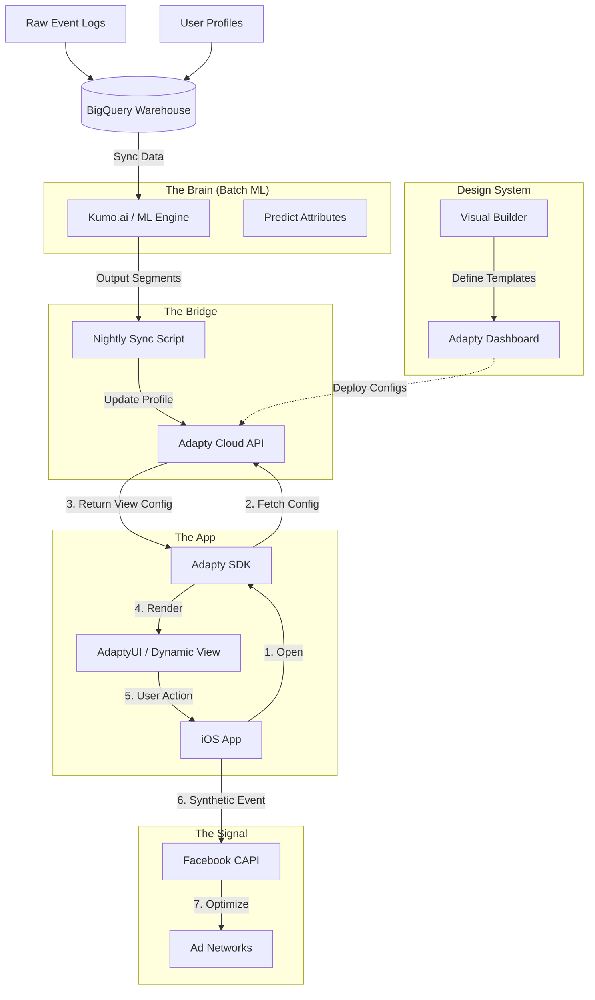

```mermaid
graph TD
    %% Data Layer
    BigQuery[(BigQuery Warehouse)]
    EventLogs[Raw Event Logs]
    UserTable[User Profiles]
    
    %% ML Layer (Offline/Batch)
    subgraph "The Brain (Batch ML)"
    Kumo[Kumo.ai / ML Engine]
    Prediction[Predict Attributes]
    end
    
    %% Transport Layer
    subgraph "The Bridge"
    SyncScript[Nightly Sync Script]
    AdaptyCloud[Adapty Cloud API]
    end
    
    %% App Layer
    subgraph "The App"
    iOSApp[iOS App]
    AdaptySDK[Adapty SDK]
    DynamicView[AdaptyUI / Dynamic View]
    end
    
    %% Marketing Feedback Loop
    subgraph "The Signal"
    CAPI[Facebook CAPI]
    Marketing[Ad Networks]
    end
    
    %% Design Layer (Offline)
    subgraph "Design System"
    AdaptyDash[Adapty Dashboard]
    VisualBuilder[Visual Builder]
    end
    
    %% Connections
    EventLogs & UserTable --> BigQuery
    BigQuery -->|Sync Data| Kumo
    Kumo -->|Output Segments| SyncScript
    
    %% Delivery Path
    SyncScript -->|Update Profile| AdaptyCloud
    VisualBuilder -->|Define Templates| AdaptyDash
    AdaptyDash -.->|Deploy Configs| AdaptyCloud
    
    %% Runtime Path
    iOSApp -->|1. Open| AdaptySDK
    AdaptySDK -->|2. Fetch Config| AdaptyCloud
    AdaptyCloud -->|3. Return View Config| AdaptySDK
    AdaptySDK -->|4. Render| DynamicView
    
    %% Feedback Path
    DynamicView -->|5. User Action| iOSApp
    iOSApp -->|6. Synthetic Event| CAPI
    CAPI -->|7. Optimize| Marketing
```
