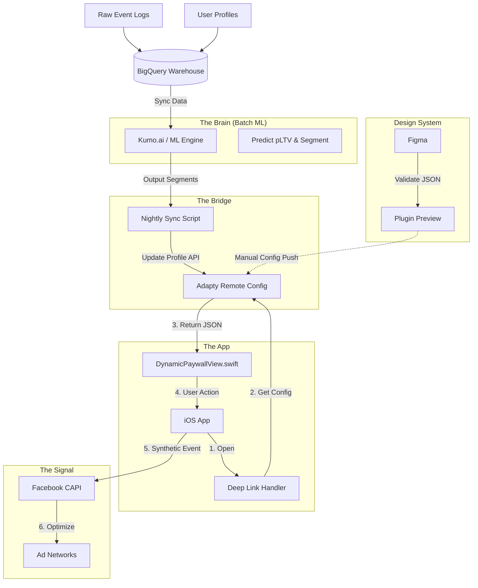

```mermaid
graph TD
    %% Data Layer
    BigQuery[(BigQuery Warehouse)]
    EventLogs[Raw Event Logs]
    UserTable[User Profiles]
    
    %% ML Layer (Offline/Batch)
    subgraph "The Brain (Batch ML)"
    Kumo[Kumo.ai / ML Engine]
    Prediction[Predict pLTV & Segment]
    end
    
    %% Transport Layer
    subgraph "The Bridge"
    SyncScript[Nightly Sync Script]
    Adapty[Adapty Remote Config]
    end
    
    %% App Layer
    subgraph "The App"
    iOSApp[iOS App]
    DeepLinkHandler[Deep Link Handler]
    DynamicView[DynamicPaywallView.swift]
    end
    
    %% Marketing Feedback Loop
    subgraph "The Signal"
    CAPI[Facebook CAPI]
    Marketing[Ad Networks]
    end
    
    %% Design Layer (Offline)
    subgraph "Design System"
    Figma[Figma]
    Plugin[Plugin Preview]
    end
    
    %% Connections
    EventLogs & UserTable --> BigQuery
    BigQuery -->|Sync Data| Kumo
    Kumo -->|Output Segments| SyncScript
    
    %% Delivery Path
    SyncScript -->|Update Profile API| Adapty
    Figma -->|Validate JSON| Plugin
    Plugin -.->|Manual Config Push| Adapty
    
    %% Runtime Path
    iOSApp -->|1. Open| DeepLinkHandler
    DeepLinkHandler -->|2. Get Config| Adapty
    Adapty -->|3. Return JSON| DynamicView
    
    %% Feedback Path
    DynamicView -->|4. User Action| iOSApp
    iOSApp -->|5. Synthetic Event| CAPI
    CAPI -->|6. Optimize| Marketing
```
