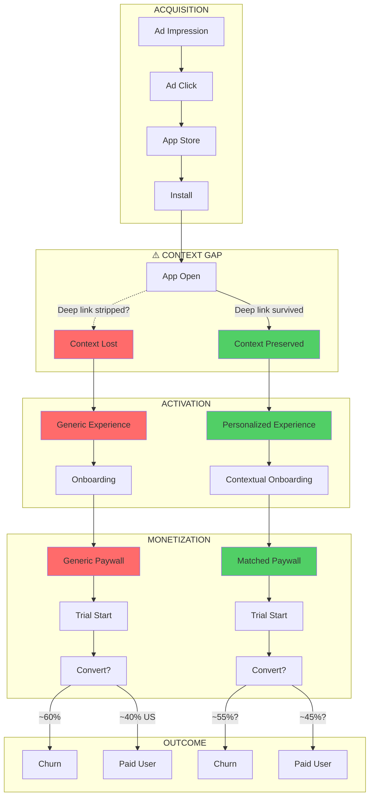
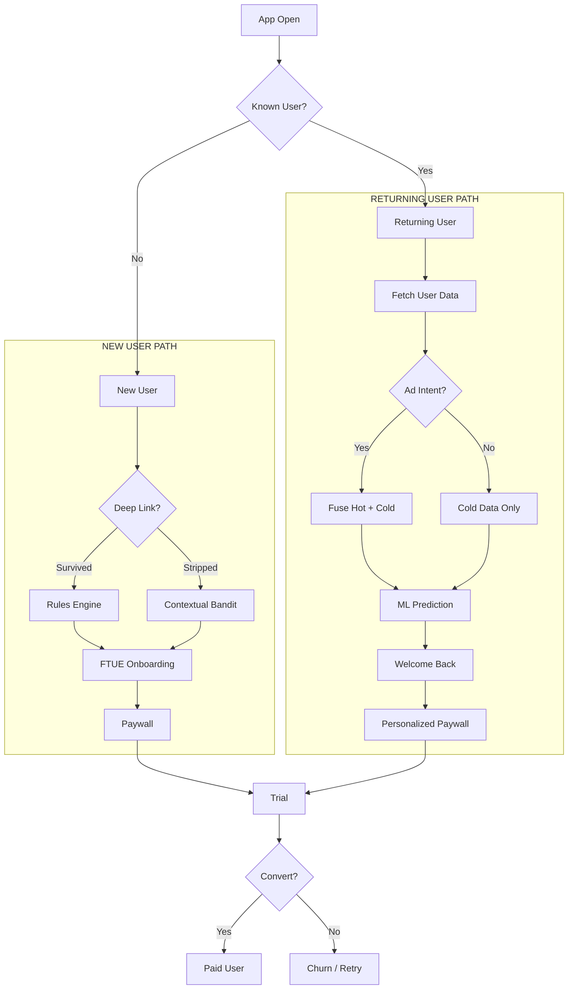
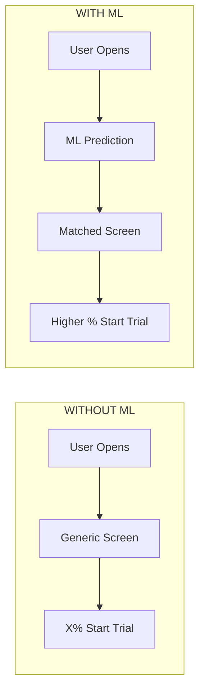

# Funnel & User Journey Diagram

Reference diagram for strategy-v3. Shows the conversion funnel with user type branches.

---

## The Funnel (With Context Gap)

---

## User Type Branches

---

## Drop-off Points (The Problem)

| Stage | What Happens | Drop-off Risk |
|-------|--------------|---------------|
| Ad → Click | User sees ad | Low intent clicks |
| Click → Install | App Store visit | Store friction, reviews |
| Install → Open | First launch | Never opens, forgets |
| **Open → Onboarding** | **Context gap** | **Wrong experience shown** |
| Onboarding → Paywall | Value prop | Not convinced |
| Paywall → Trial | Pricing decision | Price mismatch |
| Trial → Paid | 7-day experience | Didn't find value |

**Our focus:** The Open → Paywall segment. This is where personalization has highest leverage.

---

## The ML Intervention Point

**The goal:** Insert ML prediction between App Open and Screen Render to increase **Paywall → Trial** conversion.

> **Note:** Trial → Paid is already ~40% (US). The leverage point is getting more users to START trials, not converting trials to paid.

---

## Funnel Metrics

### Known Data (Dec 2025)

| Metric | Value | Source |
|--------|-------|--------|
| **Trial → Paid** | **~40%** | Team (US only) |
| Global Trial → Paid | TBD | Need from team |

> **Key Insight:** Trial → Paid is much higher than typical assumptions (~40% US vs assumed ~12%). The bottleneck is earlier in funnel: **Paywall → Trial**, not Trial → Paid.

### Estimated Full Funnel (Needs Validation)

| Stage | Current | With ML | Notes |
|-------|---------|---------|-------|
| Open → Onboarding Complete | ~60%? | ~75%? | Estimate |
| Onboarding → Trial Start | **?** | **?** | **Key bottleneck — need real data** |
| Trial → Paid | ~40% (US) | ~45%? | Already high, less room to improve |
| **Overall: Open → Paid** | **?** | **?** | Depends on Paywall → Trial |

> ⚠️ Most numbers above are illustrative. The 40% Trial → Paid (US) is real. Other metrics needed from team.
