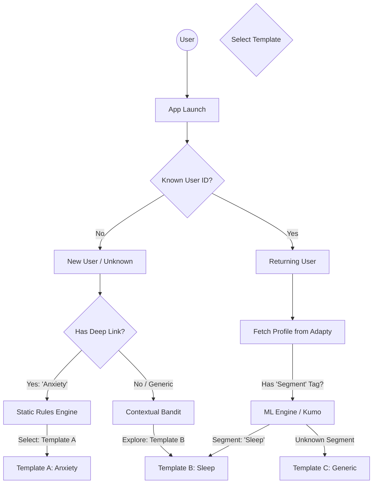

```mermaid
graph TD
    %% Nodes
    User((User))
    App[App Launch]
    
    CheckID{Known User ID?}
    
    %% Path 1: New User (Cold Start)
    NewUser[New User / Unknown]
    DeepLink{Has Deep Link?}
    
    %% Logic Layer - New
    RulesEngine[Static Rules Engine]
    ContextBandit[Contextual Bandit]
    
    %% Path 2: Existing User (History)
    ReturningUser[Returning User]
    ProfileLookup[Fetch Profile from Adapty]
    
    %% Logic Layer - Existing
    MLModel[ML Engine / Kumo]
    
    %% Decision Point
    ConfigDecision{Select Template}
    
    %% Output
    TemplateA[Template A: Anxiety]
    TemplateB[Template B: Sleep]
    TemplateC[Template C: Generic]
    
    %% Flow
    User --> App
    App --> CheckID
    
    %% New User Flow
    CheckID -->|No| NewUser
    NewUser --> DeepLink
    DeepLink -->|Yes: 'Anxiety'| RulesEngine
    DeepLink -->|No / Generic| ContextBandit
    RulesEngine -->|Select: Template A| TemplateA
    ContextBandit -->|Explore: Template B| TemplateB
    
    %% Existing User Flow
    CheckID -->|Yes| ReturningUser
    ReturningUser --> ProfileLookup
    ProfileLookup -->|Has 'Segment' Tag?| MLModel
    MLModel -->|Segment: 'Sleep'| TemplateB
    
    %% Fallback
    MLModel -->|Unknown Segment| TemplateC
```
