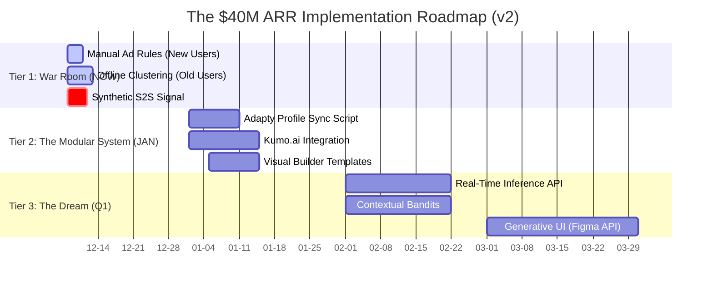

```mermaid
gantt
    title The $40M ARR Implementation Roadmap (v2)
    dateFormat  YYYY-MM-DD
    axisFormat  %m-%d
    
    section Tier 1: War Room (NOW)
    Manual Ad Rules (New Users)      :active, t1, 2025-12-08, 3d
    Offline Clustering (Old Users)   :active, t2, 2025-12-08, 5d
    Synthetic S2S Signal             :crit, t3, 2025-12-08, 4d
    
    section Tier 2: The Modular System (JAN)
    Adapty Profile Sync Script       :t4, 2026-01-01, 10d
    Kumo.ai Integration              :t5, 2026-01-01, 14d
    Visual Builder Templates         :t6, 2026-01-05, 10d
    
    section Tier 3: The Dream (Q1)
    Real-Time Inference API          :t7, 2026-02-01, 21d
    Contextual Bandits               :t8, 2026-02-01, 21d
    Generative UI (Figma API)        :t9, 2026-03-01, 30d
```
