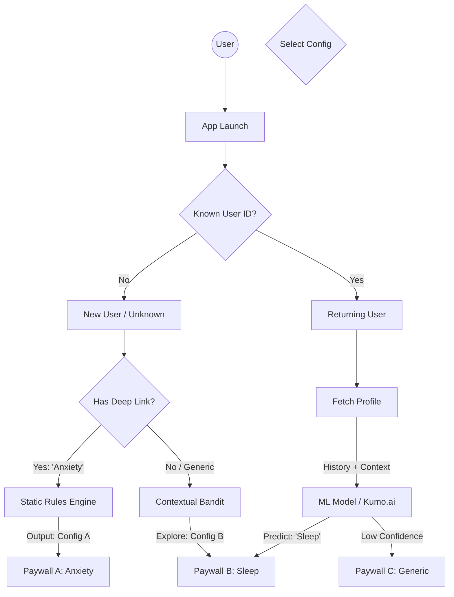

```mermaid
graph TD
    %% Nodes
    User((User))
    App[App Launch]
    
    CheckID{Known User ID?}
    
    %% Path 1: New User (Cold Start)
    NewUser[New User / Unknown]
    DeepLink{Has Deep Link?}
    
    %% Logic Layer - New
    RulesEngine[Static Rules Engine]
    ContextBandit[Contextual Bandit]
    
    %% Path 2: Existing User (History)
    ReturningUser[Returning User]
    ProfileLookup[Fetch Profile]
    
    %% Logic Layer - Existing
    MLModel[ML Model / Kumo.ai]
    
    %% Decision Point
    ConfigDecision{Select Config}
    
    %% Output
    PaywallA[Paywall A: Anxiety]
    PaywallB[Paywall B: Sleep]
    PaywallC[Paywall C: Generic]
    
    %% Flow
    User --> App
    App --> CheckID
    
    %% New User Flow
    CheckID -->|No| NewUser
    NewUser --> DeepLink
    DeepLink -->|Yes: 'Anxiety'| RulesEngine
    DeepLink -->|No / Generic| ContextBandit
    RulesEngine -->|Output: Config A| PaywallA
    ContextBandit -->|Explore: Config B| PaywallB
    
    %% Existing User Flow
    CheckID -->|Yes| ReturningUser
    ReturningUser --> ProfileLookup
    ProfileLookup -->|History + Context| MLModel
    MLModel -->|Predict: 'Sleep'| PaywallB
    
    %% Fallback
    MLModel -->|Low Confidence| PaywallC
```