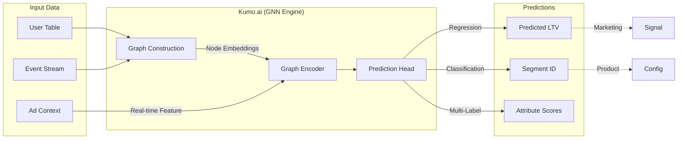

```mermaid
graph LR
    %% Inputs
    subgraph "Input Data"
    Users[User Table]
    Events[Event Stream]
    Context[Ad Context]
    end
    
    %% The Engine
    subgraph "Kumo.ai (GNN Engine)"
    Graph[Graph Construction]
    Encoder[Graph Encoder]
    Predictor[Prediction Head]
    end
    
    %% Outputs
    subgraph "Predictions"
    pLTV[Predicted LTV]
    Segment[Segment ID]
    Attributes[Attribute Scores]
    end
    
    %% Logic
    Users & Events --> Graph
    Graph -->|Node Embeddings| Encoder
    Context -->|Real-time Feature| Encoder
    Encoder --> Predictor
    
    Predictor -->|Regression| pLTV
    Predictor -->|Classification| Segment
    Predictor -->|Multi-Label| Attributes
    
    %% Usage
    pLTV -.->|Marketing| CAPI[Signal]
    Segment -.->|Product| Adapty[Config]
```